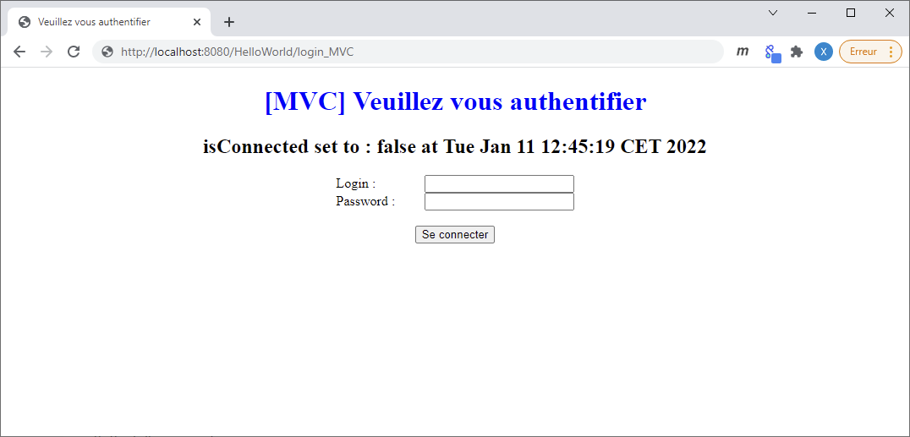
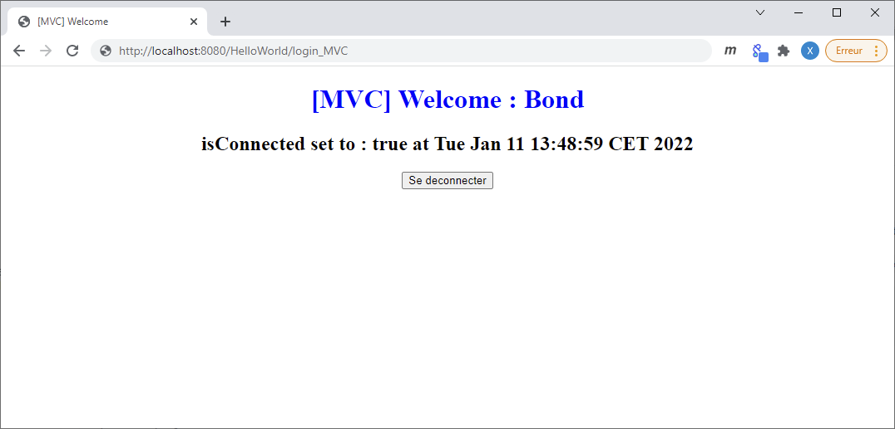

# Java EE - Implementation of an MVC architecture based on Servlet and JSP APIs <!-- omit in TOC -->

<div align="center">


|[previous](./../JAVA_EE_-_Our_first_JSP/Readme.md)|[index](./../Readme.md)|[next](./../Java_EE_-_Servlet_lifecyle/Readme.md)|
|---|---|---|

</div>

## Summary <!-- omit in TOC -->

- [Introduction](#introduction)
- [Java Controller (Servlet) : Login_MVC.java](#java-controller-servlet--login_mvcjava)
  - [doGet](#doget)
  - [doPost](#dopost)
- [View (JSP)](#view-jsp)
  - [Login_MVC.jsp](#login_mvcjsp)
    - [Result](#result)
    - [view comparison beetween Login_MVC.jsp and Login.jsp](#view-comparison-beetween-login_mvcjsp-and-loginjsp)
- [Bonus](#bonus)
  - [view : Connected.jsp](#view--connectedjsp)
  - [controller : Logout.java](#controller--logoutjava)
    - [Result](#result-1)
- [Resource](#resource)

<br>
<br>

___

## Introduction

We notice during the previous chapters that : 

||programming language|Advantage|Disadvantage|
|---|---|---|---|
|[Servlet](../JAVA_EE_-_Our_first_Servlet/Readme.md)|java|Good for answer HTTP requests and do treatment in java|Bad for define a complex HTML flux |
|[JSP](../JAVA_EE_-_Our_first_JSP/Readme.md)|HTML enhanced|Good for define our HTML page|Bad for do some treatment in java|

So now the goal is to take advantage of both technologie :
* JSP
* Servlet

And for that we will use the MVC (Model View Controller) architecture based on servlet and JSP.

<a href="MVC.svg" target="_blank"  rel="noopener">


</a>

<details>
<summary>mermaid code</summary>

```code
graph LR
        A((User <br> Browser))--"HTTP Request"-->
        B[" Java Controller <br><br>Servlet : <br> Login_MVC.java <br> linked to : /login_MVC <br> will be the url terminaison endpoint"]--"MAJ model"-->
        C["Model of data <br><br> Session HTTP <br>"]--"Injection of data <br> from Model to view"-->
        D["HTML View <br><br> Login_MVC.jsp"]--"HTTP Response"-->A
        B--"redirection"-->D

```
</details>

<br>

Like we see earlier we have 2 way for handling that ``web.xml`` or ``annotation`` here we will use ``web.xml``.

  web.xml
```xml
  <servlet>
  	<servlet-name>Login_MVC</servlet-name>
  	<servlet-class>com.tutorial.hello.Login_MVC</servlet-class>
  </servlet>
  
  <servlet-mapping>
  	<servlet-name>Login_MVC</servlet-name>
  	<url-pattern>/login_MVC</url-pattern>
  </servlet-mapping>
```

<details>
<summary>equivalence annotation inside : <code>Login_MVC.java</code></summary>

```java
@WebServlet("/login_MVC")
public class Login_MVC extends HttpServlet {
	private static final long serialVersionUID = 1L;
       
```
</details>

<br>
<br>

___

## Java Controller (Servlet) : Login_MVC.java

### doGet

First we write the ``doGet`` method, this method will be target when we hit the following url : ``http://localhost:8080/HelloWorld/login_MVC``.

In this method we keep only the java code from ``Login.java`` so we remove the output flux and the implementation of the view inside previous servlet.

Then we decide to add an ``HttpSession`` object ``session`` for handling session base on browser navigation and be able to keep our ``login`` and ``password`` value for each user inside our ``back-end`` application. This value will be accessible on our ``back-end`` and ``front-end`` and linked to the session only mean the browser. That's the part wich handling our ``Model of data``.

```java
        /*
        request.getSession(true) will create the session if doesn't exist so 
        that's not possible to have a pointer null exception with this synthax
        */
        HttpSession session = request.getSession(true);
       session.setAttribute("login", login);
       session.setAttribute("password", password);
```

<br>

then we redirect the request to our ``view``, that's mean to : [``Login_MVC.jsp``](#login_mvcjsp)

```java
        //redirect
       request.getRequestDispatcher("/Login_MVC.jsp").forward(request, response);
```


<table align="center">
	<caption>doGet comparison</caption>
	<thead>
	<tr>
		<th><code>Login_MVC.java</code></th>
		<th><code>Login.java</code></th>
	</tr>
	</thead>
	<tbody>
	<tr>
		<td>

```java
	/**
	 * @see HttpServlet#doGet(HttpServletRequest request, HttpServletResponse response)
	 */
	protected void doGet(HttpServletRequest request, HttpServletResponse response) throws ServletException, IOException {
		// TODO Auto-generated method stub
		
		response.setContentType("text/html");
		
        String login = request.getParameter( "txtLogin" );
        String password = request.getParameter( "txtPassword" );
        if ( login == null ) login = "";
        if ( password == null ) password = "";
        
        /*
        request.getSession(true) will create the session if doesn't exist so 
        that's not possible to have a pointer null exception with this synthax
        */
        HttpSession session = request.getSession(true);
       session.setAttribute("login", login);
       session.setAttribute("password", password);
       
       System.out.println( "in the doGet and request ContextPath : " + request.getContextPath().toString());
       
        
       //redirect
      request.getRequestDispatcher("/Login_MVC.jsp").forward(request, response);
	}
```     
</td>
		<td>

```java
	/**
	 * @see HttpServlet#doGet(HttpServletRequest request, HttpServletResponse response)
	 */
	protected void doGet(HttpServletRequest request, HttpServletResponse response) throws ServletException, IOException {
		// TODO Auto-generated method stub
		
		response.setContentType("text/html");
		
        String login = request.getParameter( "txtLogin" );
        String password = request.getParameter( "txtPassword" );
        if ( login == null ) login = "";
        if ( password == null ) password = "";
        
        
		//Since java 7 the type PrintWriter implement the interface Closeable
        //so we are not oblige to close the flux implicitaly because that's will be
        //done explicitaly with this try catch implementation
        try ( PrintWriter out = response.getWriter() ) {
            out.println( "<!DOCTYPE html>" );
            out.println( "<html>" );
            out.println( "    <head>" );
            out.println( "        <title>Veuillez vous identifier</title>" );
            out.println( "        <link rel='stylesheet' type='text/css' href='styles.css' />" );
            out.println( "    </head>" );
            out.println( "    <body>" );
            out.println( "        <h1>Veuillez vous identifier</h1>" );
            out.println( "        <h2>" + new Date() + "</h2>" );
            
            
            out.println( "        <form method='POST' action='login'>" );
            out.println( "            <label for='txtLogin'>Login :</label>" ); 
            out.println( "            <input id='txtLogin' name='txtLogin' type='text' value='" + login + "' autofocus /><br/>" );
            out.println( "            <label for='txtPassword'>Password :</label>" ); 
            out.println( "            <input name='txtPassword' type='password' value='" + password + "' /><br/>" );
            out.println( "            <br/>" );
            out.println( "            <input name='btnConnect' type='submit' value='Se connecter' /><br/>" );
            out.println( "        </form>" );
            
            out.println( "    </body>" );
            out.println( "</html>" );
            

        }
		
		response.getWriter().append("Served at: ").append(request.getContextPath());
	}
```
</td>
	</tr>
	</tbody>
</table>

<br>

### doPost

Inside the doPost method we add the session value like inside our doGet for the same purpose then we redirect the response in both case :
* if the login and password are correct then we redirect to [``Connected.jsp``](#view--connectedjsp) and set a new session value ``isConnected`` to true.
* else we redirect the request to ``/Login_MVC`` and set ``isConnected`` to false.

```java
        	session.setAttribute("isConnected", true);
        	request.getRequestDispatcher("/Connected.jsp").forward(request, response);
```

<br>

<table align="center">
	<caption>doPost comparison</caption>
	<thead>
	<tr>
		<th><code>Login_MVC.java</code></th>
		<th><code>Login.java</code></th>
	</tr>
	</thead>
	<tbody>
	<tr>
		<td>

```java
	/**
	 * @see HttpServlet#doPost(HttpServletRequest request, HttpServletResponse response)
	 */
    protected void doPost(HttpServletRequest request, HttpServletResponse response) throws ServletException, IOException {
        String login = request.getParameter( "txtLogin" );
        String password = request.getParameter( "txtPassword" );
        
        
        /*
        request.getSession(true) will create the session if doesn't exist so 
        that's not possible to have a pointer null exception with this synthax
        */
       HttpSession session = request.getSession(true);
       session.setAttribute("login", login);
       session.setAttribute("password", password);
         
       System.out.println( "in the doPost and request ContextPath : " + request.getContextPath().toString());

        if ( login.equals( "Bond" ) && password.equals( "007" ) ) {
        	session.setAttribute("isConnected", true);
        	request.getRequestDispatcher("/Connected.jsp").forward(request, response);
        	
        } else {
        	session.setAttribute("isConnected", false);
        	request.getRequestDispatcher("/Login_MVC.jsp").forward(request, response);
        	
        }
    }
```     
</td>
		<td>

```java
	/**
	 * @see HttpServlet#doPost(HttpServletRequest request, HttpServletResponse response)
	 */
    protected void doPost(HttpServletRequest request, HttpServletResponse response) throws ServletException, IOException {
        String login = request.getParameter( "txtLogin" );
        String password = request.getParameter( "txtPassword" );
         
        System.out.println( "in the doPost" );

        if ( login.equals( "Bond" ) && password.equals( "007" ) ) {
            response.setContentType( "text/html" );
            try ( PrintWriter out = response.getWriter() ) {
                out.println( "OK" );
            }
        } else {
            doGet( request, response );
        }
    }
```
</td>
	</tr>
	</tbody>
</table>

<br>
<br>

___

## View (JSP) 
### Login_MVC.jsp

We simply remove java code from Login.jsp and do some adaptation inside our form for use the session value that we define inside our controller.

Note that we have 2 synthax possible for retrieve data from the session :
```jsp
<%= session.getAttribute("password") %>
```
and 
```jsp
${password}
```

<br>

When the form is ``submit`` by clicking on ``btnConnect`` we want to send a ``post`` request to this url pattern ``login_MVC`` wich is link to the ``Login_MVC.java`` inside our web.xml.
<details>
<summary>web.xml</summary>

```xml
  <servlet>
  	<servlet-name>Login_MVC</servlet-name>
  	<servlet-class>com.tutorial.hello.Login_MVC</servlet-class>
  </servlet>
  
  <servlet-mapping>
  	<servlet-name>Login_MVC</servlet-name>
  	<url-pattern>/login_MVC</url-pattern>
  </servlet-mapping>
```
</details>

```html
    <form method="post" action="login_MVC">
        <!--code-->
        <input name='btnConnect' type='submit' value='Se connecter' /> <br/>
    </form>
```
So in end when we will click on ``Se connecter`` we will ``submit`` our form and trigger our [``Login_MVC.java doPost method``](#dopost).

#### Result



<br>

#### view comparison beetween Login_MVC.jsp and Login.jsp

<table align="center">
	<caption>view comparison</caption>
	<thead>
	<tr>
		<th><code>Login_MVC.jsp</code></th>
		<th><code>Login.jsp</code></th>
	</tr>
	</thead>
	<tbody>
	<tr>
		<td>

```html
<%@page language="java" contentType="text/html; charset=UTF-8" pageEncoding="UTF-8"%>
<%@page import="java.util.Date"%>
<!DOCTYPE html>
<html>
    <head>
        <meta charset="UTF-8" />
        <title>Veuillez vous authentifier</title>
        <link rel='stylesheet' type='text/css' href='styles.css' />
    </head>
    <body>
        <h1>[MVC] Veuillez vous authentifier</h1>
        <h2>isConnected set to : ${isConnected} at <%= new Date() %></h2>
    

            <form method="post" action="login_MVC">
                <label for='txtLogin'>Login :</label>
                <input id='txtLogin' name='txtLogin' type='text' value='${login}' autofocus /> <br/>
                <label for='txtPassword'>Password :</label>
				
				
				<!-- 
				here we comment the old synthax :
				<input name='txtPassword' type='password' value='<%= session.getAttribute("password") %>' /> <br/>
				
				and let's the newer equivalent synthax present :
				 -->                
                <input name='txtPassword' type='password' value='${password}' /> <br/>
                
                <br/>
                <input name='btnConnect' type='submit' value='Se connecter' /> <br/>
            </form>
  
    </body>
</html>
```     
</td>
		<td>

```html
<%@page language="java" contentType="text/html; charset=UTF-8" pageEncoding="UTF-8"%>
<%@page import="java.util.Date"%>
<!DOCTYPE html>
<html>
    <head>
        <meta charset="UTF-8" />
        <title>Veuillez vous authentifier</title>
        <link rel='stylesheet' type='text/css' href='styles.css' />
    </head>
    <body>
        <h1>Veuillez vous authentifier</h1>
        <h2><%= new Date() %></h2>
    
        <%
            String login = request.getParameter( "txtLogin" );
            String password = request.getParameter( "txtPassword" );
            if ( login == null ) login = "";
            if ( password == null ) password = "";
            
            if ( request.getMethod().equals( "POST" ) && login.equals( "bond" ) && password.equals( "007" ) ) {
        %>
            <p>Welcome <%= login %></p>
        <% } else { %>
            <form method="post" action="login">
                <label for='txtLogin'>Login :</label>
                <input id='txtLogin' name='txtLogin' type='text' value='<%= login %>' autofocus /> <br/>
                <label for='txtPassword'>Password :</label>
                <input name='txtPassword' type='password' value='<%= password %>' /> <br/>
                <br/>
                <input name='btnConnect' type='submit' value='Se connecter' /> <br/>
            </form>
        <% } %>     
    </body>
</html>
```
</td>
	</tr>
	</tbody>
</table>

<br>

<br>
<br>

## Bonus
### view : Connected.jsp

Like you see in this view we display the name of the user connected and have a button for disconnect the user that will trigger the ``url pattern : /logout`` so ``Logout.java doPost method``.

but for this case we define with ``annotation`` inside ``Logout.java`` the link beetween the ``url-pattern`` and the our .class instead of our ``web.xml``.
```java
@WebServlet("/logout")
public class Logout extends HttpServlet {
```

<br>

```html
<%@page language="java" contentType="text/html; charset=UTF-8" pageEncoding="UTF-8"%>
<%@page import="java.util.Date"%>
<!DOCTYPE html>
<html>
    <head>
        <meta charset="UTF-8" />
        <title>[MVC] Welcome</title>
        <link rel='stylesheet' type='text/css' href='styles.css' />
    </head>
    <body>
        <h1>[MVC] Welcome : ${login}</h1>
        <h2>isConnected set to : ${isConnected} at <%= new Date() %></h2>
    

            <form method="post" action="logout">
                <input name='btnConnect' type='submit' value='Se deconnecter' /> <br/>
            </form>
  
    </body>
</html>
```

<br>

### controller : Logout.java

Here we simply kill the session with :
```java
        request.getSession().invalidate();
```

then we redirect the request to [``Login_MVC.jsp``](#view--connectedjsp)
```java
    	response.sendRedirect(request.getContextPath() + "/Login_MVC.jsp");
```

<br>

with the following code :
```java
package com.tutorial.hello;

import java.io.IOException;

import javax.servlet.ServletException;
import javax.servlet.annotation.WebServlet;
import javax.servlet.http.HttpServlet;
import javax.servlet.http.HttpServletRequest;
import javax.servlet.http.HttpServletResponse;
import javax.servlet.http.HttpSession;

@WebServlet("/logout")
public class Logout extends HttpServlet {

    @Override
    protected void doPost(HttpServletRequest request, HttpServletResponse response) throws ServletException, IOException {
        request.getSession().invalidate();
    	response.sendRedirect(request.getContextPath() + "/Login_MVC.jsp");
    }

}
```

#### Result



<br>
<br>

<div align="center">

|[previous](./../JAVA_EE_-_Our_first_JSP/Readme.md)|[index](./../Readme.md)|[next](./../Java_EE_-_Servlet_lifecyle/Readme.md)|
|---|---|---|


</div>

<br>
<br>


___

## Resource

* [TUTO JAVA EE - Mise en place d'une architecture MVC à partir des API Servlet et JSP [Dominique Liard][FR]](https://www.youtube.com/watch?v=yjJALFHAb-o&list=PLBNheBxhHLQyuFBZHx20kGByDoySutwBf&index=4)
* [Java EE course materials [Dominique Liard][FR]](https://koor.fr/Java/JavaEE.wp)
* [Mise en place d'une architecture MVC à partir des API Servlet et JSP [Dominique Liard][FR]](https://koor.fr/Java/TutorialJEE/jee_servlet_jsp_mvc.wp)