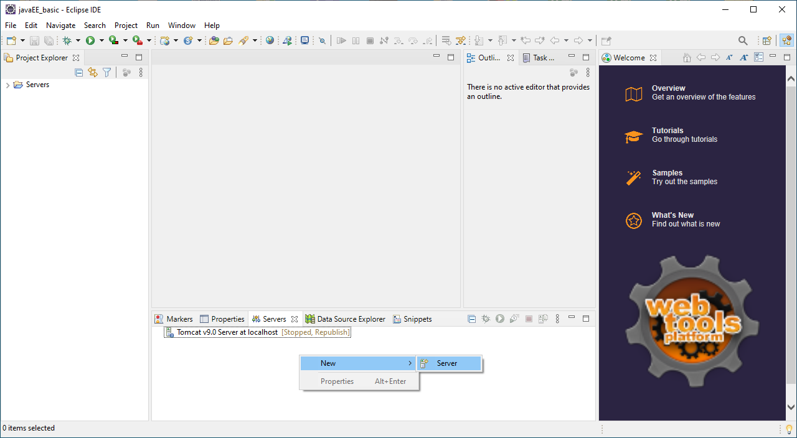
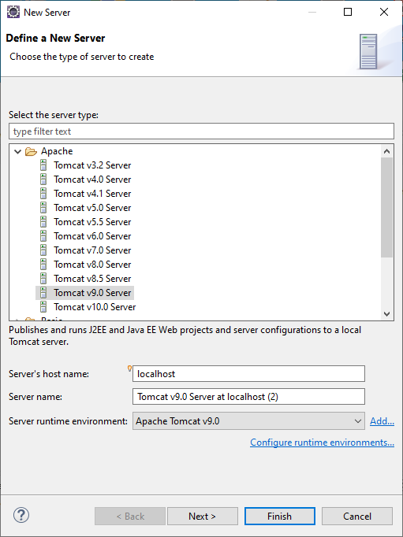
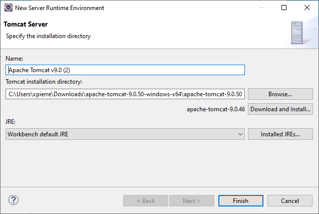
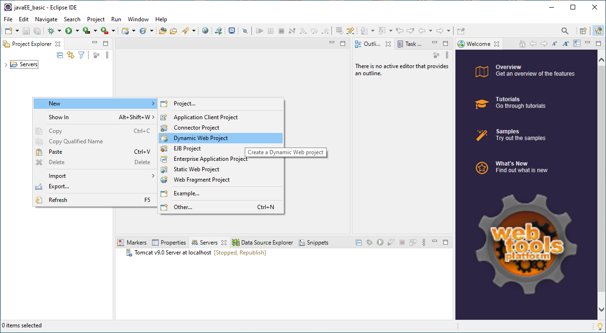
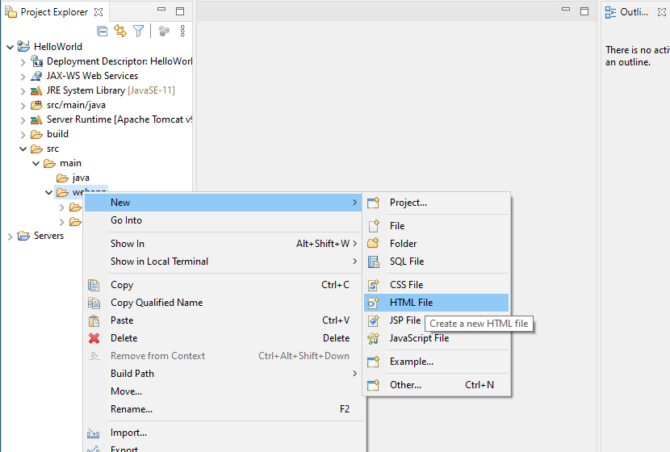
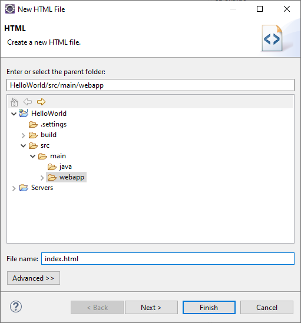
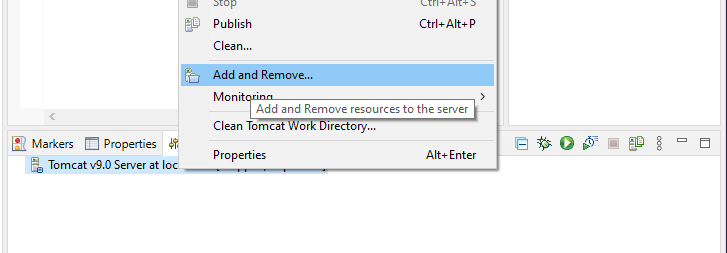
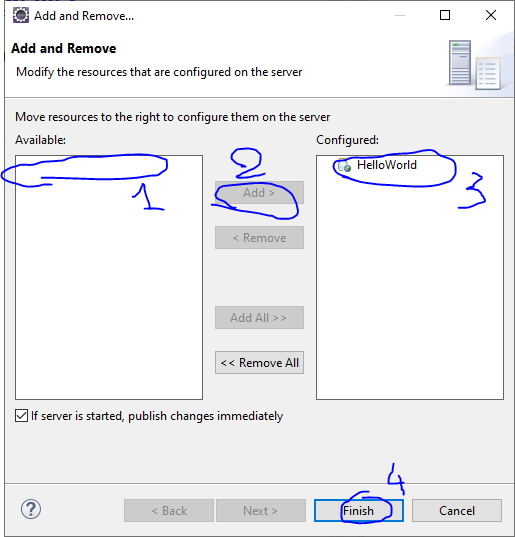
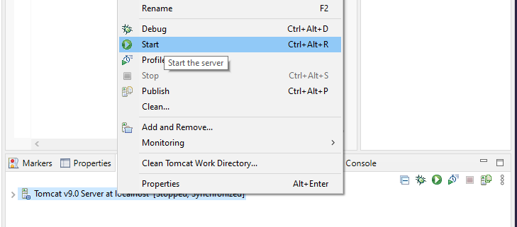
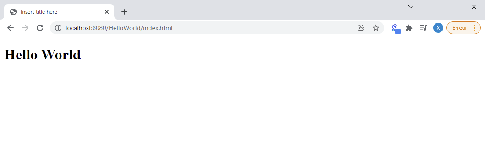

# Java EE - Integrate Tomcat/Eclipse <!-- omit in TOC -->

<div align="center">


|[index](./../Readme.md)|[next](./../JAVA_EE_-_Our_first_Servlet/Readme.md)|
|---|---|

</div>

## Summary <!-- omit in TOC -->

- [Create a Tomcat server](#create-a-tomcat-server)
- [Create a dynamic web project : HelloWorld](#create-a-dynamic-web-project--helloworld)
- [Create a new static webpage](#create-a-new-static-webpage)
- [Launch your web project on your local tomcat web server](#launch-your-web-project-on-your-local-tomcat-web-server)
  - [Add your web project on your tomcat server](#add-your-web-project-on-your-tomcat-server)
  - [Launch your web project on your tomcat server](#launch-your-web-project-on-your-tomcat-server)
- [Resource](#resource)

<br>
<br>

____

## Create a Tomcat server

1. Launch : __```Eclipse IDE for Enterprise Java and Web Developers```__
2. Create your workplace
3. Follow the next step for create a new server :

<details>
<summary>step 1 : right click inside <strong style="color:red">server</strong> tabs > New > Server </summary>



</details>

<details>
<summary>step 2 : select Apache > Tomcat v9.0 Server (Tomcat version 9.0...) > Add...</summary>



</details>

<details>
<summary>step 3 : Browse > Put the folder containing tomcat on your device </summary>



For me this folder is : 
```
C:\Users\xpierre\Downloads\apache-tomcat-9.0.50-windows-x64\apache-tomcat-9.0.50
```

<br>

**Note :** if you haven't Apache tomcat yet then you can install it from this link : 
* Tomcat 9 : https://tomcat.apache.org/download-90.cgi

</details>


<br>
<br>

___

## Create a dynamic web project : HelloWorld

<details>
<summary>step 1 : right click inside <strong style="color:red">project explorer</strong> tabs > New > Dynamic web project </summary>



</details>

<details>
<summary>step 2 : setup project name and Dynamic web module version </summary>


</details>

<br>
<br>

___

## Create a new static webpage

Create a new Html page (index.html) inside :

```
src > main > java > webapp
```

for that you will need to follow the step :

<details>
<summary>step 1 : right click on src > main > <strong style="color:red">webapp</strong> inside <strong style="color:red">project explorer</strong> tabs > New > HTML File </summary>



</details>

<details>
<summary>step 2 : name your webpage </summary>



</details>

<br>
<br>

___

## Launch your web project on your local tomcat web server
### Add your web project on your tomcat server

<details>
<summary>step 1 : right click on tomcat web server > Add and Remove... > Add your project > Finish </summary>



<br>

then :



</details>

<br>

### Launch your web project on your tomcat server



<br>


check it with your web browser : 
```
http://localhost:8080/HelloWorld/index.html
```




**Note :** 8080 is the default port configuration for tomcat

<br>
<br>

<div align="center">


|[index](./../Readme.md)|[next](./../JAVA_EE_-_Our_first_Servlet/Readme.md)|
|---|---|

</div>


<br>
<br>

___

## Resource

* [TUTO JAVA EE - Intégration Tomcat/Eclipse [Dominique Liard][FR]](https://www.youtube.com/watch?v=yjJALFHAb-o&list=PLBNheBxhHLQyuFBZHx20kGByDoySutwBf&index=1)
* [Java EE course materials [Dominique Liard][FR]](https://koor.fr/Java/JavaEE.wp)
* [Intégration Tomcat/Eclipse [Dominique Liard][FR]](https://koor.fr/Java/TutorialJEE/jee_eclipse_tomcat.wp)