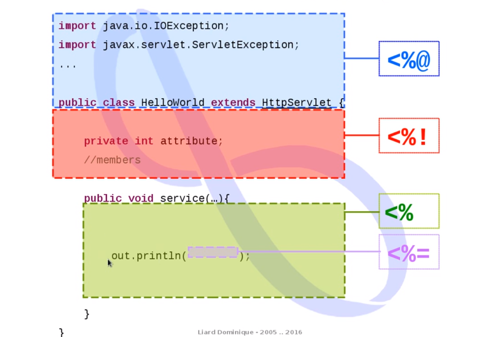
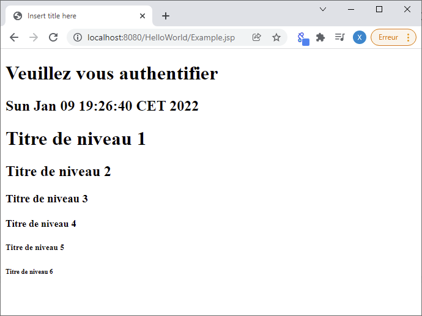
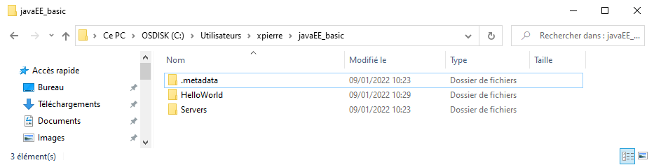
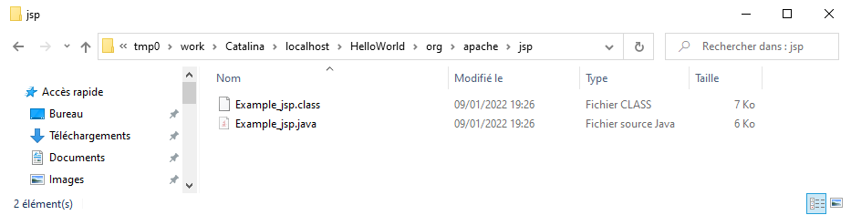
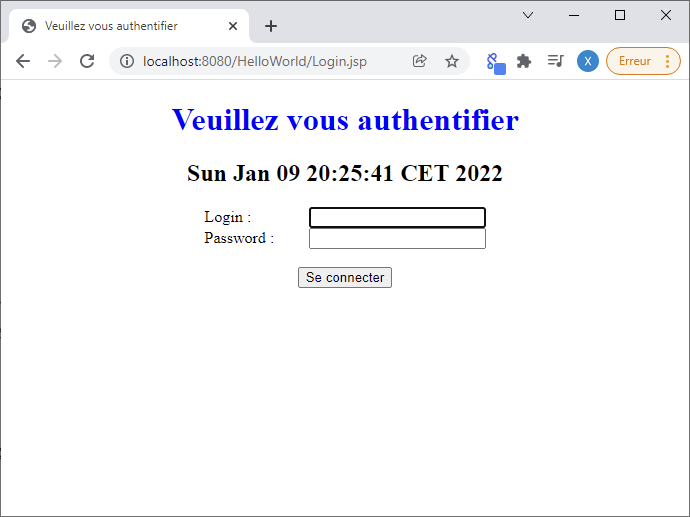

# Java EE - Our first JSP <!-- omit in TOC -->

<div align="center">


|[previous](./../JAVA_EE_-_Our_first_Servlet/Readme.md)|[index](./../Readme.md)|[next](./../JAVA_EE_-_Implementation_of_an_MVC_architecture_based_on_Servlet_and_JSP_APIs/Readme.md)|
|---|---|---|

</div>

## Summary <!-- omit in TOC -->

- [Introduction](#introduction)
  - [Synthaxe reminder](#synthaxe-reminder)
- [Example.jsp](#examplejsp)
  - [How it works?](#how-it-works)
  - [Result](#result)
- [Login.jsp](#loginjsp)
  - [Result](#result-1)
- [Resource](#resource)

<br>
<br>

____

## Introduction

__A JSP is a code hosted by your HTTP server and this code will be interpreted when someone try to get a content from it with the browser. At this moment, the JSP file will be interpreted and translate in a Servlet file__ 

This tutorial shows how to quickly implement your first JSP. 

The following example inside ``Example.jsp`` is here for understand how the JSP work.

Then the next example ``Login.jsp`` is here for reproduce the authentication form we did on [previous tutorial about our first servlet](./../JAVA_EE_-_Our_first_Servlet/Readme.md).

<br>

### Synthaxe reminder

<div align="center">


initial synthaxe

|synthaxe <br> <div align="center">open</div>|synthaxe <br> <div align="center">close</div>|description|
|---|---|---|
|``<%@``|``%>``|They are placed on top of the file, and they are useful for control the import and the class from wich we will derive|
|``<%!``|``%>``|That's for add attribut and method inside our servlet|
|``<%``|``%>``|That's for write inside the service method|
|``<%=``|``%>``|That's for write inside a display order called inside the service method|

</div>

<br>
<br>

___

## Example.jsp

<details>
<summary>Example.jsp</summary>

```jsp
<%@ page language="java" contentType="text/html; charset=UTF-8"
    pageEncoding="UTF-8"%>
<%@ page import="java.util.Date"%>
<!DOCTYPE html>
<html>
<head>
<meta charset="UTF-8">
<title>Insert title here</title>
</head>
<body>
	<h1>Veuillez vous authentifier</h1>
	<h2><%= new Date() %></h2>
	
	<% for(int i=1; i<=6; i++){ %>
		<h<%= i %>>Titre de niveau <%= i %></h<%= i %>>
	<% } %>
</body>
</html>
```

</details>

will produce :



### How it works?

For understand how it's work? We take the folder explorater and go inside our workpsace like the following image



Then we go inside ``.metadata`` at :

```
...\.metadata\.plugins\org.eclipse.wst.server.core\tmp0\work\Catalina\localhost\HelloWorld\org\apache\jsp
```

and here we can find 2 files :



<br>

<table align="center">
	<caption>Comparison</caption>
	<thead>
	<tr>
		<th>Servlet generated by our Example.jsp</th>
		<th>Servlet equivalence</th>
	</tr>
	</thead>
	<tbody>
	<tr>
		<td>

```java
  public void _jspService(final javax.servlet.http.HttpServletRequest request, 
  final javax.servlet.http.HttpServletResponse response)
      throws java.io.IOException, javax.servlet.ServletException {
```

Here we can see that the code generated from the ``JSP`` is equivalent to a ``doGet`` method in servlet in this case.

But in fact a ``Servlet`` method contain a ``Service`` method, this ``Service`` method receive normally all the request. 

This service method retrieve the submission method :
```java
      final java.lang.String _jspx_method = request.getMethod();
```

and with this will ``dispatch`` the content inside the different method we see in last tutorial ``doPost`` and ``doGet`` by a dispatcher :

```java
    if (!javax.servlet.DispatcherType.ERROR.equals(request.getDispatcherType())) {
      final java.lang.String _jspx_method = request.getMethod();
      if ("OPTIONS".equals(_jspx_method)) {
        response.setHeader("Allow","GET, HEAD, POST, OPTIONS");
        return;
      }
      if (!"GET".equals(_jspx_method) && !"POST".equals(_jspx_method) && !"HEAD".equals(_jspx_method)) {
        response.setHeader("Allow","GET, HEAD, POST, OPTIONS");
        response.sendError(HttpServletResponse.SC_METHOD_NOT_ALLOWED, "Les JSPs ne permettent que GET, POST ou HEAD. Jasper permet aussi OPTIONS");
        return;
      }
    }
```

</td>
<td>

```java
	protected void doGet(HttpServletRequest request, HttpServletResponse response) 
    throws ServletException, IOException {
```


</td>
	</tr>
	<tr>
<td>

```java
      out.write("<!DOCTYPE html>\r\n");
      out.write("<html>\r\n");
      out.write("<head>\r\n");
      out.write("<meta charset=\"UTF-8\">\r\n");
      out.write("<title>Insert title here</title>\r\n");
      out.write("</head>\r\n");
      out.write("<body>\r\n");
      out.write("	<h1>Veuillez vous authentifier</h1>\r\n");
      out.write("	<h2>");
```
</td>

<td>

```java
            out.println( "<!DOCTYPE html>" );
            out.println( "<html>" );
            out.println( "    <head>" );
            out.println( "        <title>Veuillez vous identifier</title>" );
            out.println( "        <link rel='stylesheet' type='text/css' href='styles.css' />" );
            out.println( "    </head>" );
            out.println( "    <body>" );
            out.println( "        <h1>Veuillez vous identifier</h1>" );
```

</td>
	</tr>
	<tr>
<td>
</table>

<br>

```java
      out.print( new Date() );
```
because we write inside the ``JSP`` file : 

```jsp
	<h2><%= new Date() %></h2>
```

using the ``<%=`` and ``%>`` synthax

<br>

also to be able to import ``Date`` we use the synthax ``<%@`` and ``%>`` that we see earlier : 

```jsp
<%@ page import="java.util.Date"%>
```
</td>
<td>

```java
            out.println( "        <h2>" + new Date() + "</h2>" );
```

<br>

and the import 
```java
import java.util.Date;
```

</td>
	</tr>
	</tbody>
</table>

<br>

### Result


<br>
<br>

___

## Login.jsp

Now we create a ``Login.jsp`` equivalent to what we did on [previous tutorial about our first servlet](./../JAVA_EE_-_Our_first_Servlet/Readme.md). 

```jsp
<%@page language="java" contentType="text/html; charset=UTF-8" pageEncoding="UTF-8"%>
<%@page import="java.util.Date"%>
<!DOCTYPE html>
<html>
    <head>
        <meta charset="UTF-8" />
        <title>Veuillez vous authentifier</title>
        <link rel='stylesheet' type='text/css' href='styles.css' />
    </head>
    <body>
        <h1>Veuillez vous authentifier</h1>
        <h2><%= new Date() %></h2>
    
        <%
            String login = request.getParameter( "txtLogin" );
            String password = request.getParameter( "txtPassword" );
            if ( login == null ) login = "";
            if ( password == null ) password = "";
            
            if ( request.getMethod().equals( "POST" ) && login.equals( "bond" ) && password.equals( "007" ) ) {
        %>
            <p>Welcome <%= login %></p>
        <% } else { %>
            <form method="post" action="login">
                <label for='txtLogin'>Login :</label>
                <input id='txtLogin' name='txtLogin' type='text' value='<%= login %>' autofocus /> <br/>
                <label for='txtPassword'>Password :</label>
                <input name='txtPassword' type='password' value='<%= password %>' /> <br/>
                <br/>
                <input name='btnConnect' type='submit' value='Se connecter' /> <br/>
            </form>
        <% } %>     
    </body>
</html>
```

<br>

### Result



<br>
<br>

<div align="center">

|[previous](./../JAVA_EE_-_Our_first_Servlet/Readme.md)|[index](./../Readme.md)|[next](./../JAVA_EE_-_Implementation_of_an_MVC_architecture_based_on_Servlet_and_JSP_APIs/Readme.md)|
|---|---|---|


</div>

<br>
<br>


___

## Resource

* [TUTO JAVA EE - Notre première JSP [Dominique Liard][FR]](https://www.youtube.com/watch?v=yjJALFHAb-o&list=PLBNheBxhHLQyuFBZHx20kGByDoySutwBf&index=3)
* [Java EE course materials [Dominique Liard][FR]](https://koor.fr/Java/JavaEE.wp)
* [Notre première JSP (Java Server Page) [Dominique Liard][FR]](https://koor.fr/Java/TutorialJEE/jee_jsp.wp)