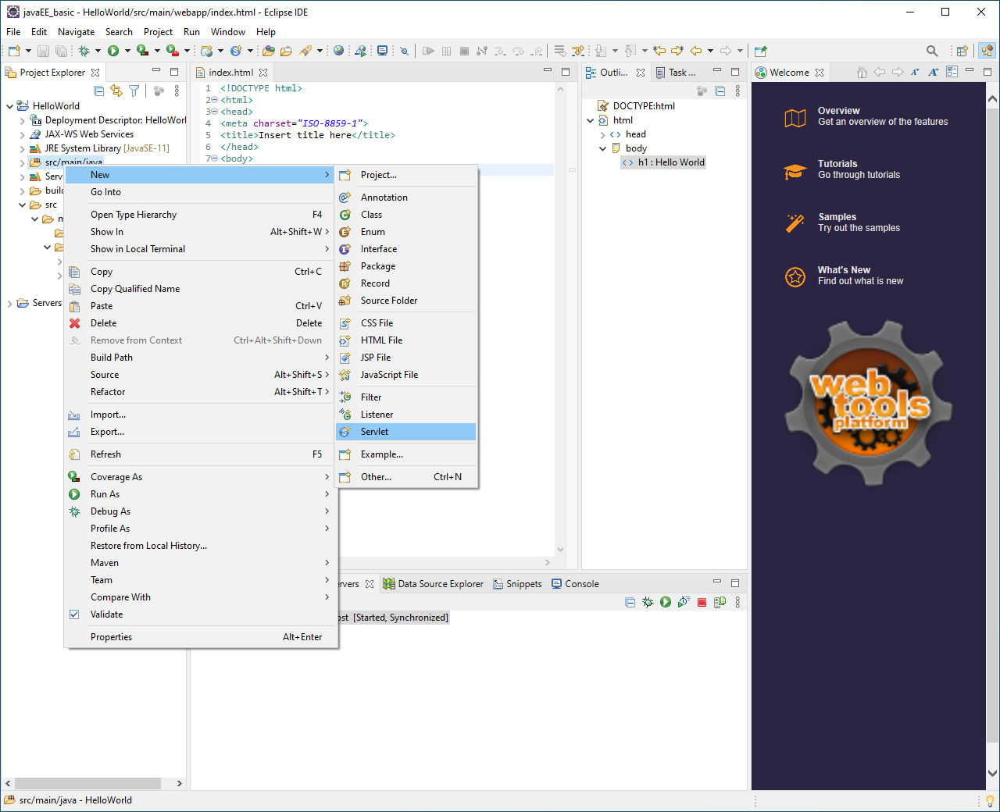
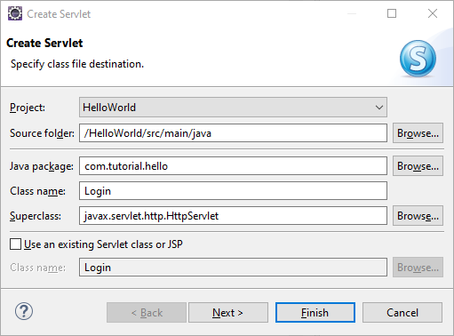
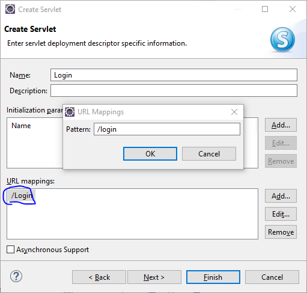
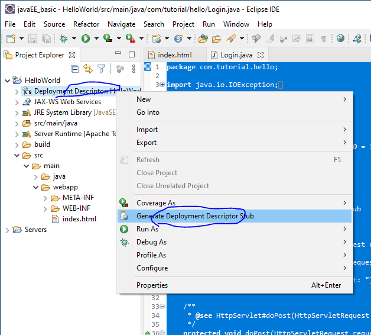
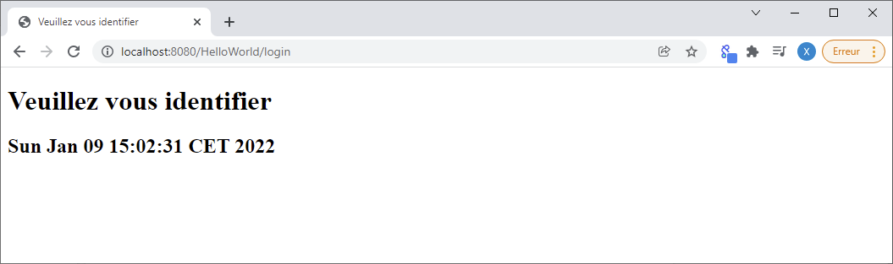
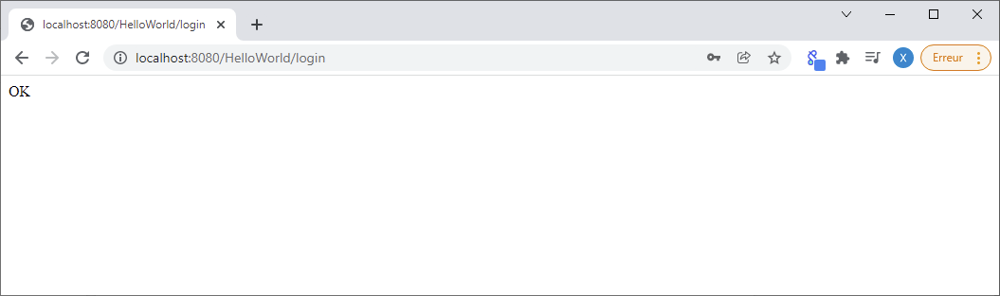
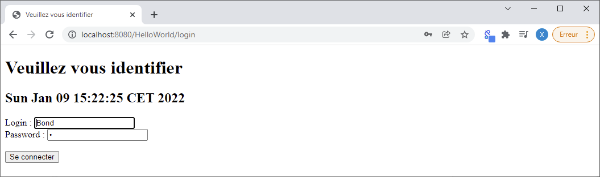
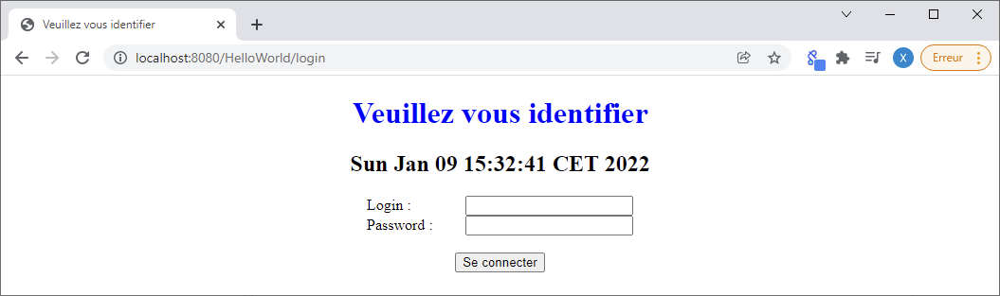

# Java EE - Our first Servlet <!-- omit in TOC -->

<div align="center">


|[previous](../JAVA_EE_-_Integration_TomcatEclipse/Readme.md)|[index](./../Readme.md)|[next](./../JAVA_EE_-_Our_first_JSP/Readme.md)|
|---|---|---|

</div>

## Summary <!-- omit in TOC -->

- [Introduction](#introduction)
- [Create a Servlet](#create-a-servlet)
  - [URL mappings](#url-mappings)
  - [URL mappings equivalence beetween web.xml and annotation](#url-mappings-equivalence-beetween-webxml-and-annotation)
- [doGet](#doget)
  - [setContentType](#setcontenttype)
  - [create flux for the response](#create-flux-for-the-response)
  - [create formulaire](#create-formulaire)
- [doPost](#dopost)
  - [Result](#result)
- [Resource](#resource)

<br>
<br>

____

## Introduction

__A servlet is a Java code hosted by your HTTP server and whose purpose is to produce the response (often HTML) to an HTTP request.__ 

This tutorial shows how to quickly implement your first servlet. 

The following example is an authentication form: the data entered in the form are sent and processed on the Web server.

<br>
<br>

___

## Create a Servlet

Like a Servlet is a Java code, we need to create our servlet where we have our Java code so for that :

<details>
<summary>step 1 : right click on <strong style="color:red">src/main/java</strong> tabs > New > Servlet for calling the servlet creator assistant </summary>



</details>

<br>

<details>
<summary>step 2 : then define the following information before clicking on next : </summary>



</details>

* Java package : ```com.tutorial.hello```
* Class name : ```Login```

<br>

<details>
<summary>step 3 : define URL mappings : </summary>



</details>

* Default value : ```/Login``` => use the classname like the default value for URL mappings
* Our value : ```/login``` => we redefine the value. 

__Important : for java EE URL mappings is case sensitive__

<br>

That's will automatically create this code :
```java
package com.tutorial.hello;

import java.io.IOException;
import javax.servlet.ServletException;
import javax.servlet.annotation.WebServlet;
import javax.servlet.http.HttpServlet;
import javax.servlet.http.HttpServletRequest;
import javax.servlet.http.HttpServletResponse;

/**
 * Servlet implementation class Login
 */
@WebServlet("/login")
public class Login extends HttpServlet {
	private static final long serialVersionUID = 1L;
       
    /**
     * @see HttpServlet#HttpServlet()
     */
    public Login() {
        super();
        // TODO Auto-generated constructor stub
    }

	/**
	 * @see HttpServlet#doGet(HttpServletRequest request, HttpServletResponse response)
	 */
	protected void doGet(HttpServletRequest request, HttpServletResponse response) throws ServletException, IOException {
		// TODO Auto-generated method stub
		response.getWriter().append("Served at: ").append(request.getContextPath());
	}

	/**
	 * @see HttpServlet#doPost(HttpServletRequest request, HttpServletResponse response)
	 */
	protected void doPost(HttpServletRequest request, HttpServletResponse response) throws ServletException, IOException {
		// TODO Auto-generated method stub
		doGet(request, response);
	}

}
```

<br>
<br>

### URL mappings

As you can see the link beetween url Mappings and java class are define like this :
```java
@WebServlet("/login")
public class Login extends HttpServlet {
```

But this is the case for recent Java before that's define inside ``web.xml`` file so for generate our ``web.xml`` we need to right click on ``Deployment Descriptor`` > ```Generate Deployment Descriptor Stub``` like the following image :



After that a ``web.xml`` will be generated here :
```
src > main > webapp > WEB-INF > web.xml
```

<br>

### URL mappings equivalence beetween web.xml and annotation

<table class="demo" align=center>
	<caption>URL mappings</caption>
	<thead>
	<tr>
		<th>web.xml (old java EE)</th>
		<th>.class & annotation (recent java EE)</th>
	</tr>
	</thead>
	<tbody>
	<tr>
<td>

```xml
  <servlet>
  	<servlet-name>Login</servlet-name>
  	<servlet-class>com.tutorial.hello.Login</servlet-class>
  </servlet>
  
  <servlet-mapping>
  	<servlet-name>Login</servlet-name>
  	<url-pattern>/login</url-pattern>
  </servlet-mapping>
```
        
</td>
		<td>

```java
/**
 * Servlet implementation class Login
 */
@WebServlet("/login")
public class Login extends HttpServlet {
```
        
</td>
</tr>
	<tr>
		<td>


The link beewteen ``<servlet>`` and ``<servlet-mapping>`` are defined by ``<servlet-name>``. 

In our case we link our ``Login.java`` (``Login.class``) with the url pattern ``/login``
        
</td>
		<td>

In this case the link is directly created inside the ``.java`` file
        
        
</td>
	</tr>
	</tbody>
</table>

<br>
<br>

___

## doGet

doGet corresponds to the fact that when in the browser we mark the url of the page then we press enter, then we ask for an html resource and doGet is here for answer this request.

|param|description|
|---|---|
|``HttpServletRequest request``| contains the data send by the browser to tomcat |
|``HttpServletResponse response``|contains the data send back to the browser by tomcat|

<br>

### setContentType
1. first we need to describe the response content type :
```java
response.setContentType("text/html");
```

<br>

### create flux for the response
2. we need to create a flux for our response :
```java
		/*
        Since java SE 7 the type PrintWriter implement the interface Closeable
        so we are not oblige to close the flux implicitaly because that's
        will be done explicitaly with the construction try with resources
        and of course that's a basic try catch so you can handle error with
        it
        */
        try ( PrintWriter out = response.getWriter() ) {
            out.println( "<!DOCTYPE html>" );
            out.println( "<html>" );
            out.println( "    <head>" );
            out.println( "        <title>Veuillez vous identifier</title>" );
            out.println( "        <link rel='stylesheet' type='text/css' href='styles.css' />" );
            out.println( "    </head>" );
            out.println( "    <body>" );
            out.println( "        <h1>Veuillez vous identifier</h1>" );
            out.println( "        <h2>" + new Date() + "</h2>" );
        }
```



<br>

### create formulaire

we create a formulaire wich will send information to our ``login.java`` file inside our backend with method ``POST`` for that we use the line :
```java
            out.println( "        <form method='POST' action='login'>" );
```

<br>

Finally we want to send a login and a password so the complete code is : 

```java
            out.println( "        <form method='POST' action='login'>" );
            out.println( "            <label for='txtLogin'>Login :</label>" ); 
            out.println( "            <input id='txtLogin' name='txtLogin' type='text' value='" + login + "' autofocus /><br/>" );
            out.println( "            <label for='txtPassword'>Password :</label>" ); 
            out.println( "            <input name='txtPassword' type='password' value='" + password + "' /><br/>" );
            out.println( "            <br/>" );
            out.println( "            <input name='btnConnect' type='submit' value='Se connecter' /><br/>" );
            out.println( "        </form>" );
```

__This information from the formulaire will be send by the browser and trigger the doPost method so later we can retrieve the formulaire information inside the doPost method and the request parameter__

<br>
<br>

___

## doPost

Like we say earlier we trigger the ``login doPost method`` with the formulaire inside the ``login doGet method`` and then we can retrieve the ``login`` and ``password`` value with : 
```java
        String login = request.getParameter( "txtLogin" );
        String password = request.getParameter( "txtPassword" );
```

In our case we will display ``OK`` if the login and password equal respectively Bond and 007. Otherwise we will display the same login page.

```java
    protected void doPost(HttpServletRequest request, HttpServletResponse response) throws ServletException, IOException {
        String login = request.getParameter( "txtLogin" );
        String password = request.getParameter( "txtPassword" );
         
        System.out.println( "in the doPost" );

        if ( login.equals( "Bond" ) && password.equals( "007" ) ) {
            response.setContentType( "text/html" );
            try ( PrintWriter out = response.getWriter() ) {
                out.println( "OK" );
            }
        } else {
            doGet( request, response );
        }
    }
```

### Result

Login = Bond & Password = 007 :



<br>

Otherwise :



Note that for keep the login and password content after trying to connect we have added inside our doGet :
```java
        String login = request.getParameter( "txtLogin" );
        String password = request.getParameter( "txtPassword" );
        if ( login == null ) login = "";
        if ( password == null ) password = "";
```
So when we don't write the right login or password then the value will be retrieve from what we write on the formulaire.

<br>

As you remember inside the doGet we define a css style for our content 
```java
            out.println( "        <link rel='stylesheet' type='text/css' href='styles.css' />" );
```
So we can create a ``style.css`` file inside ``src > main > webapp`` for change the style of our content.

```css
h1, h2, form {
	text-align : center;
}

h1 {
	color: blue;
}

label {
	display: inline-block;
	width: 100px;
	text-align: left;
}
```

<br>

and then we obtain this result :




<br>
<br>

<div align="center">

|[previous](../JAVA_EE_-_Integration_TomcatEclipse/Readme.md)|[index](./../Readme.md)|[next](./../JAVA_EE_-_Our_first_JSP/Readme.md)|
|---|---|---|

</div>

<br>
<br>

___

## Resource

* [TUTO JAVA EE - Notre première servlet [Dominique Liard][FR]](https://www.youtube.com/watch?v=yjJALFHAb-o&list=PLBNheBxhHLQyuFBZHx20kGByDoySutwBf&index=2)
* [Java EE course materials [Dominique Liard][FR]](https://koor.fr/Java/JavaEE.wp)
* [Notre première servlet [Dominique Liard][FR]](https://koor.fr/Java/TutorialJEE/jee_servlet.wp)