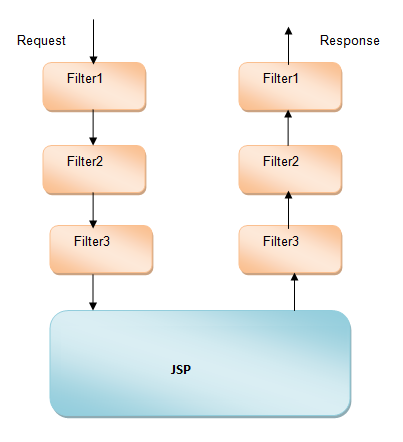
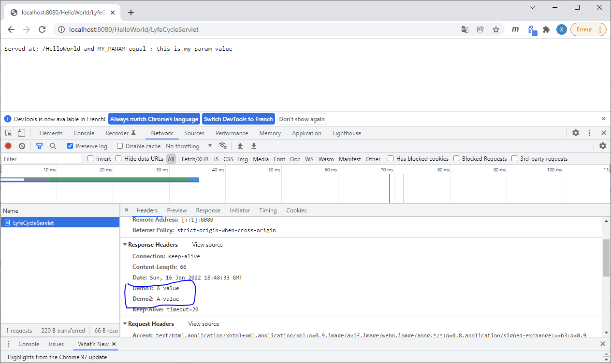

# Java EE - Servlet filters <!-- omit in TOC -->

<div align="center">


|[previous](./../Java_EE_-_Servlet_lifecyle/Readme.md)|[index](./../Readme.md)|[next](./../JAVA_EE_-_Annotation_Details_in_Servlet_3/Readme.md)|
|---|---|---|

</div>

## Summary <!-- omit in TOC -->

- [Introduction](#introduction)
  - [One popular scenario :](#one-popular-scenario-)
- [Filter Interface and life cycle](#filter-interface-and-life-cycle)
- [Filter Configuration](#filter-configuration)
  - [Filter Ordering](#filter-ordering)
    - [Example](#example)
- [Example filtering the Header inside the response](#example-filtering-the-header-inside-the-response)
- [Resource](#resource)

<br>
<br>

___

## Introduction

``Servlet Filters`` are java classes designed to be able to manipulate a request or response objects which is being sent to a web application (``servlet`` or ``JSP`` : remember that servlet and JSP are linked to each other because a JSP can generate some part of our servlet code...). A filter is used to perform certain logic before and / or after the functionality of a web application.

### One popular scenario : 
You want to protect your servlet which mean client must be able to access the servlet’s doXXX() methods if and only if the client is eligible.

To achieve this type of functionality, we have 2 possibilities :
1. permission checker logic inside your servlet<strong>s</strong>
2. <strong style="color:red;">use a filter and implement this checker inside, so the filter gets executed first and determine the permission. If client is eligible then pass the request to Servlet.</strong>

<br>

The second solution is better because that's allow you to __avoid the two following issue__ from the first solution :
* You have to write repetitive code if permission needs to be applied on multiple resource.
* Having permission logic in separate component keeps the design good and we will have right logic in right component.

An other advantage of Filters is the fact they are configured in ``web.xml`` so they can be easily attached or detached from servlets and to do it no change on code are needed.

<br>
<br>

___

## Filter Interface and life cycle

Filter class has to implement ``javax.servlet.Filter`` ``interface``. Filter interface defines three methods which means classes implements filter interface has to implement these methods :
* ``Filter.init`` : This method is called only once after instantiation to perform any initialization task. We can define a initialization parameters in ``web.xml`` for filters similar to ``init-params`` of servlets.
* ``Filter.destroy`` : This method is used to perform any cleanup operation before the container removes a filter instance.
* ``Filter.doFilter`` : This method is called after the ``init()`` method and is called each time a filter needs to perform any function. This method performs the actual work of a filter, either modifying the request or the response.


<br>
<br>

___

## Filter Configuration

Same filter configuration can be done with ``@WebFilter`` annotation as shown below. ``@WebFilter`` annotation is highlighted below and all the attributes configured in web,xml are configured in annotation itself. With this approach , we need not to configure any entry in ``web.xml ``for ``MyFilter``.
* ``filterName``- defines the name of filter
* ``urlPatterns`` – maps the servlet to the pattern
* ``description`` – description about servlet
* ``initParams`` – takes multiple ``@WebInitParam`` annotation

<table align="center">
	<caption>comparison comparison beetween <code>web.xml</code> and <code>annotation</code></caption>
	<thead>
	<tr>
		<th><code>web.xml</code></th>
		<th><code>MyFilter.java</code></th>
	</tr>
	</thead>
	<tbody>
	<tr>
		<td>

```xml
  <filter>
      <filter-name>MyFilter</filter-name>
      <filter-class>com.servlet.tutorial.MyFilter</filter-class>
      <init-param>
           <description>param 1 description</description>
           <param-name>param1</param-name>
          <param-value>value 1</param-value>
      </init-param>
       <init-param>
           <description>param 2 description</description>
           <param-name>param2</param-name>
          <param-value>value 2</param-value>
      </init-param>
  </filter>
  <filter-mapping>
      <filter-name>MyFilter</filter-name>
      <url-pattern>/*</url-pattern>
  </filter-mapping>
```     
</td>
		<td>

```java
@WebFilter(
filterName="MyFilter",
urlPatterns="/*",
description="Filter description",
initParams={
@WebInitParam(name="param1",value="value 1",description="param 1 description "),
@WebInitParam(name="param2", value="value 2", description="param 2 description ")
})
public class MyFilter implements Filter {
    @Override
    public void init(FilterConfig filterConfig) throws ServletException {
        System.out.println("Filter initialized...");
    }
    @Override
    public void doFilter(ServletRequest request, ServletResponse response,
            FilterChain filterChain) throws IOException, ServletException {
        System.out.println("Filter executing...");
        filterChain.doFilter(request, response);
    }
    @Override
    public void destroy() {
        System.out.println("Filter Destroyed..");
    }   
}
```
</td>
	</tr>
	</tbody>
</table>

<br>

### Filter Ordering

We can have multiple filters configured and all of them will be executed.

The order of filter execution depends on the filters order configured inside ``web.xml``. For example if there are two Filter1 and Filter2 configured like below :

```xml
<filter>
    <filter-name>Filter1</filter-name>
    <filter-class>com.servlet.tutorial.Filter1</filter-class>
        <init-param>
            <param-name>my-param</param-name>
            <param-value>my-param-value</param-value>
        </init-param>
</filter>
<filter-mapping>
    <filter-name>Filter1</filter-name>
    <url-pattern>/*</url-pattern>
</filter-mapping>


<filter>         
    <filter-name>Filter2</filter-name>
    <filter-class>com.servlet.tutorial.Filter2</filter-class>
        <init-param>
            <param-name>my-param</param-name>
            <param-value>my-param-value</param-value>
        </init-param>
</filter>
<filter-mapping>
    <filter-name>Filter2</filter-name>
    <url-pattern>/*</url-pattern>
</filter-mapping>


<filter>         
    <filter-name>Filter3</filter-name>
    <filter-class>com.servlet.tutorial.Filter3</filter-class>
        <init-param>
            <param-name>my-param</param-name>
            <param-value>my-param-value</param-value>
        </init-param>
</filter>
<filter-mapping>
    <filter-name>Filter3</filter-name>
    <url-pattern>/*</url-pattern>
</filter-mapping>
```

On this exemple the order will be :
```
Filter1 -> Filter2 -> Filter3
```

Like on the following graph :

<div align="center">

|<div align="center">Servlet</div>|<div align="center">JSP</div>|
|---|---|
|||


</div>

<br>

**Note :** Servlet and JSP have a close relationship like you see here :
* [Java EE - Our first Servlet](/../JAVA_EE_-_Our_first_Servlet/Readme.md)
* [Java EE - Our first JSP](/../JAVA_EE_-_Our_first_JSP/Readme.md)
* [Java EE - Implementation of an MVC architecture based on Servlet and JSP APIs](/../JAVA_EE_-_Implementation_of_an_MVC_architecture_based_on_Servlet_and_JSP_APIs/Readme.md)

Because JSP can generate a part of the code of our Servlet and the opposite are also true. So servlet filter work for both JSP and Servlet. 


#### Example

To demonstrate the order of execution of multiple filter and servlet, lets define 3 filter : 
* Filter1
* Filter2
* Filter3

and apply it on Servlet.

<br>

Filter1.java :
```java
import java.io.IOException;
import javax.servlet.Filter;
import javax.servlet.FilterChain;
import javax.servlet.FilterConfig;
import javax.servlet.ServletException;
import javax.servlet.ServletRequest;
import javax.servlet.ServletResponse;


public class Filter1 implements Filter
{
    @Override
    public void init(FilterConfig filterConfig) throws ServletException
    {
    System.out.println("Filter 1 initialized...");
    }

    @Override
    public void doFilter(ServletRequest request, ServletResponse response,
    FilterChain filterChain) throws IOException, ServletException
    {
        System.out.println("Filter 1 executing Before Servlet Processing ...");
        filterChain.doFilter(request, response);
        System.out.println("Filter 1 executing after Servlet Processing...");
    }

    @Override
    public void destroy() {
        System.out.println("Filter 1 Destroyed..");
    }
}
```

``Filter2`` and ``Filter3`` have exaclty the same code but with different ``System.out.println``. 

Then we try to reach this url : ``http://localhost:8080/HelloWorld/login_MVC``

```
Filter 1 executing Before Servlet Processing ...
Filter 2 executing Before Servlet Processing ...
Filter 3 executing Before Servlet Processing ...
janv. 16, 2022 7:07:26 PM com.tutorial.hello.listeners.MySessionListener sessionCreated
INFOS: ======= Session created - 1 session in memory ======
in the doGet and request ContextPath : /HelloWorld
Filter 3 executing after Servlet Processing...
Filter 2 executing after Servlet Processing...
Filter 1 executing after Servlet Processing...
janv. 16, 2022 7:07:26 PM com.tutorial.hello.listeners.MyRequestListener requestDestroyed
INFOS: Request is produced in 333 milliseconds
Filter 1 executing Before Servlet Processing ...
Filter 2 executing Before Servlet Processing ...
Filter 3 executing Before Servlet Processing ...
Filter 3 executing after Servlet Processing...
Filter 2 executing after Servlet Processing...
Filter 1 executing after Servlet Processing...
janv. 16, 2022 7:07:27 PM com.tutorial.hello.listeners.MyRequestListener requestDestroyed
INFOS: Request is produced in 7 milliseconds
```

<br>
<br>

so that can be decomposed like this :
1. Step 1 :
```
Filter 1 executing Before Servlet Processing ...
Filter 2 executing Before Servlet Processing ...
Filter 3 executing Before Servlet Processing ...
```
``doFilter`` from ``Filter1`` is execute and ``filterChain.doFilter(request, response);`` will call ``Filter2`` ...

<br>
<br>

2. Step 2 :
```
INFOS: ======= Session created - 1 session in memory ======
in the doGet and request ContextPath : /HelloWorld
```
We are now inside the method ``doGet`` of ``Login_MVC.java`` and we create a session so we trigger our ``weblistener`` : ``MySessionListener.java``. Then after the execution of our listener we continue to execute our ``doGet`` method and we print : ``in the doGet and request ContextPath : /HelloWorld`` with ``/HelloWorld`` as our context path.

<br>
<br>

3. Step 3 :
```
Filter 3 executing after Servlet Processing...
Filter 2 executing after Servlet Processing...
Filter 1 executing after Servlet Processing...
janv. 16, 2022 7:07:26 PM com.tutorial.hello.listeners.MyRequestListener requestDestroyed
INFOS: Request is produced in 333 milliseconds
```
Then we proceed the end of ``doFilter`` for the ``Filter3`` and the code continue executing the end of ``doFilter`` for the ``Filter2``...
At the end our request are done so we trigger our listener ``MyRequestListener.java`` and then we redirect the response with :
```java
request.getRequestDispatcher("/Login_MVC.jsp").forward(request, response);
```

<br>
<br>

4. Step 4 : 
```
Filter 1 executing Before Servlet Processing ...
Filter 2 executing Before Servlet Processing ...
Filter 3 executing Before Servlet Processing ...
Filter 3 executing after Servlet Processing...
Filter 2 executing after Servlet Processing...
Filter 1 executing after Servlet Processing...
janv. 16, 2022 7:07:27 PM com.tutorial.hello.listeners.MyRequestListener requestDestroyed
INFOS: Request is produced in 7 milliseconds
```
We are redirect to ``/Login_MVC.jsp`` and this is in fact a servlet code after generation so of course we trigger again our ``Filters`` like ``Step 2 and 3`` but this time for our ``jsp``.

<br>
<br>

## Example filtering the Header inside the response

<details>
<summary>Servlet filter : <code>@WebFilter( urlPatterns="/LyfeCycleServlet" )</code></summary>

```java
@WebFilter( urlPatterns="/LyfeCycleServlet" )
public class MyFilter implements Filter {
    
    @Override
    public void init(FilterConfig filterConfig) throws ServletException {
    }
    
    @Override
    public void doFilter(ServletRequest request, ServletResponse response, FilterChain chain ) 
            throws IOException, ServletException {
        
        chain.doFilter( request, new HttpServletResponseWrapper( (HttpServletResponse) response ) {
            @Override
            public void setHeader(String name, String value) {
                if( ! name.equalsIgnoreCase( "Demo" ) ) {
                    super.setHeader(name, value);
                }
            }
        });
        
    }
    
    @Override
    public void destroy() {
    }

}
```

</details>

<details>
<summary>Servlet doGet method filter : <code>@WebServlet("/LyfeCycleServlet") </code></summary>

```java
	protected void doGet(HttpServletRequest request, HttpServletResponse response) throws ServletException, IOException {
		// TODO Auto-generated method stub
		response.setHeader("Demo", "A value");
		response.setHeader("Demo1", "A value");
		response.setHeader("Demo2", "A value");
    	System.out.println();
    	System.out.println("-----");
    	System.out.println("in the doGet method of : " + this.getClass().getName().toString());
    	countGetRequest++;
		System.out.println("The number of get request receive by the servlet LyfeCycleServlet since her first initialisation is : " + countGetRequest);
    	System.out.println("-----");
		response.getWriter().append("Served at: ").append(request.getContextPath()).append(" and MY_PARAM equal : ").append(this.getServletContext().getInitParameter("MY_PARAM").toString());
	}
```

</details>

Despite having :
```java
		response.setHeader("Demo", "A value");
		response.setHeader("Demo1", "A value");
		response.setHeader("Demo2", "A value");
```
inside our doGet method we have a response without Demo header because we remove this header with our filter. So our result is :



<br>
<br>

<div align="center">

|[previous](./../Java_EE_-_Servlet_lifecyle/Readme.md)|[index](./../Readme.md)|[next](./../JAVA_EE_-_Annotation_Details_in_Servlet_3/Readme.md)|
|---|---|---|


</div>

<br>
<br>


___

## Resource

* [TUTO JAVA EE - Web Filters [Dominique Liard][FR]](https://www.youtube.com/watch?v=yjJALFHAb-o&list=PLBNheBxhHLQyuFBZHx20kGByDoySutwBf&index=7)
* [Java EE course materials [Dominique Liard][FR]](https://koor.fr/Java/JavaEE.wp)
* [Web filters [Dominique Liard][FR]](https://koor.fr/Java/TutorialJEE/jee_servlet_filters.wp)
* [Servlet filters [wideskills][EN][Servlet tutorial]](https://www.wideskills.com/servlets/servlet-filters)
* [JSP filters [wideskills][EN][JSP tutorial]](https://www.wideskills.com/jsp/jsp-filters)