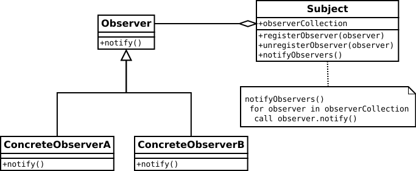

# Java EE - Web Listeners <!-- omit in TOC -->

<div align="center">


|[previous](./../Java_EE_-_Servlet_lifecyle/Readme.md)|[index](./../Readme.md)|[next](./../JAVA_EE_-_Servlet_filter/Readme.md)|
|---|---|---|

</div>

## Summary <!-- omit in TOC -->

- [Introduction](#introduction)
- [Synthax comparison beetween ``annotation`` and ``web.xml``](#synthax-comparison-beetween-annotation-and-webxml)
- [List of web listeners events](#list-of-web-listeners-events)
- [Resource](#resource)

<br>
<br>

___

## Introduction

A ``listener`` is a term commonly used in Java to designate an object that will be notified when its environment changes. In Object ``Design Patterns``, it is more commonly called a __``listener``__ or __``observer design pattern``__.

<details>
<summary>Some resources about observer desgin pattern</summary>

Article :
* [Observer design pattern [wikipedia][EN]](https://en.wikipedia.org/wiki/Observer_pattern)
* [Observer design pattern [wikipedia][FR]](https://fr.wikipedia.org/wiki/Observateur_%28patron_de_conception%29)
* [How to implement an observer design pattern [Tutorial][Derek Banas][EN]](https://www.newthinktank.com/2012/08/observer-design-pattern-tutorial/)


Video :
* [Observer Design Pattern [Tutorial][Derek Banas][EN]](https://www.youtube.com/watch?v=wiQdrH2YpT4)
* [Observer Design Pattern [Tutorial][Telusko][EN]](https://www.youtube.com/watch?v=98DiwRp-KZk)
* [Observer Design Pattern [Tutorial][Ouanis][EN]](https://www.youtube.com/watch?v=ojbT9WA70Fw)
* [Java Observer Design Pattern using java.util.Observable [Tutorial][EN][Aaron Writes Code]](https://www.youtube.com/watch?v=ohL2HIBK1pg)
* [Event Listener [Tutorial][Geeks & Geeks][EN]](https://www.youtube.com/watch?v=IdlWdwKR0hw)


</details>


|Observer (notify)|Observer (update)|
|---|---|
|[](Observer.svg)|[](Observer_w_update.svg)|

So to resume the pattern you have ``subject`` and ``observer`` object. You want to ``notify`` or ``update`` only the right ``observer`` when a changement was performed on a ``subject``. For that purpose :
* the ``subject`` should have a list of ``observer`` object wich want to be notified or updated each time a changement happen, in order to know each ``observer`` wich need to be updated : __``observerCollection``__
* the ``observer`` should register to a ``subject`` with the method ``registerObserver`` so the ``subject`` can add the ``observer`` to the list ``observerCollection``
* the ``subject`` should have a method where he will ``loop`` on every ``observer`` inside ``observerCollection`` for ``notify`` them : __``notifyObservers()``__ using an ``observer method`` : ``update or notify``
* the ``observer`` should have a method to be ``notify`` so the ``subject`` can use it while looping on ``observerCollection`` to ``notify`` the observer about each changements.


<br>

For the Java EE Web container, a listener designates a class that implements one of the interfaces defined in the servlet API.

The principle of use is the same for all types of Web listeners. If the application wishes to be notified of a particular event occurring for a ServletContext, a request or an HTTP session then it must provide an implementation of a listener. A method of the latter will be called by the container each time the event concerned occurs during the life of the application.

The different types of listeners are represented in the Servlet API by the following Java interfaces :

<br>
<br>

___

## Synthax comparison beetween ``annotation`` and ``web.xml``

<table align="center">
	<caption>comparison beetween annotation and web.xml</caption>
	<thead>
	<tr>
		<th><code>anotation</code></th>
		<th><code>web.xml</code></th>
	</tr>
	</thead>
	<tbody>
	<tr>
		<td>

```java
@WebListener
public class MyRequestListener implements ServletRequestListener {
```     
</td>
		<td>

```html
    <listener>
        <listener-class>com.tutorial.hello.listeners.MyRequestListener</listener-class>
    </listener>
```
</td>
	</tr>
	</tbody>
</table>

<br>
<br>

___

## List of web listeners events

To create a web listeners events you just need to extends one of this java interface and override the behaviour of the method trigerred on event notification.

|java interface|Event description and Method triggered by the event notification|Description|
|---|---|---|
|javax.servlet.ServletContextListener|<ul><li>Servlet context creation, at which point the first request can be serviced ``contextInitialized()``</li><li> Imminent shutdown of the servlet context ``contextDestroyed()``</li></ul>|Allows to listen to the state changes of the ServletContext. The Web container notifies the application of the creation of the ServletContext thanks to the contextInitialized method and of the destruction of the ServletContext thanks to the contextDestroyed method. It is important to understand that the ServletContext represents the Web application. So a ServletContextListener is a means of carrying out treatments at the time of the launching of the Web application and/or at the time of its stop.|
|javax.servlet.ServletContextAttributeListener|<ul><li>Addition of servlet context attributes ``attributAdded()``</li><li>Removal of servlet context attributes ``attributRemoved()``</li><li>Replacement of servlet context attributes ``attributReplaced()``</li></ul>|Allows to listen to the state changes of the attributes stored in the ServletContext (the application scope attributes). The container notifies the application of the addition of an attribute (call to the ServletContextAttributeListener.attributeAdded method), the deletion of an attribute (call to the ServletContextAttributeListener.attributeRemoved method) and the modification of an attribute (call to the ServletContextAttributeListener.attributeReplaced method.|
|javax.servlet.ServletRequestListener|<ul><li>A request is initialized/created ``requestInitialized()``</li><li>A request is destroyed/finished : ``requestInitialized()``</li></ul> |Allows to listen to the input and/or output of a request from the Web application environment. The container notifies the application of the input of a request to be processed using the requestInitialized method and of the output of the request using the requestDestroyed method.|
|javax.servlet.ServletRequestAttributeListener|<ul><li>Receives notification that an attribute has been added to the ServletRequest. ``attributeAdded()``</li><li>Receives notification that an attribute has been removed to the ServletRequest. ``attributeRemoved()``</li><li>Receives notification that an attribute has been replaced to the ServletRequest. ``attributeReplaced()``</li></ul> |Allows to listen to the state changes of the attributes stored in the HttpServletRequest (the request scope attributes). The container notifies the application of the addition of an attribute (call to the ServletRequestAttributeListener.attributeAdded method), the deletion of an attribute (call to the ServletRequestAttributeListener.attributeRemoved method) and the modification of an attribute (call to the ServletRequestAttributeListener.attributeReplaced method.|
|javax.servlet.http.HttpSessionListener|<ul><li>Session creation ``sessionCreated`` </li><li>Session invalidation ``sessionDestroyed``</li><li>Session timeout ``sessionDestroyed``</li></ul>|Allows to listen to the creation and deletion of an HttpSession. The container notifies the application of the creation of a session using the sessionCreated method and of the deletion of a session using the sessionDestroyed method. The deletion of a session means that either it has been invalidated by the application itself thanks to the HttpSession.invalidate method or it has expired and the container has decided to invalidate it.|
|javax.servlet.http.HttpSessionAttributeListener|<ul><li>Addition of session attributes ``attributAdded()``</li><li>Removal of session attributes ``attributRemoved()``</li><li>Replacement of session attributes ``attributReplaced()``</li></ul>|Allows to listen to the state changes of the attributes stored in the HttpSession (the session scope attributes). The container notifies the application of the addition of an attribute (call to the HttpSessionAttributeListener.attributeAdded method, of the deletion of an attribute (call to the HttpSessionAttributeListener.attributeRemoved method and of the modification of an attribute (call to the HttpSessionAttributeListener.attributeReplaced method.|
|javax.servlet.http.HttpSessionActivationListener|<ul><li>Notification that the session has just been activated.``sessionDidActivate()``</li><li>Notification that the session is about to be passivated. : ``sessionWillPassivate()``</li></ul>|Objects that are bound to a session may listen to container events notifying them that sessions will be passivated and that session will be activated. A container that migrates session between VMs or persists sessions is required to notify all attributes bound to sessions implementing HttpSessionActivationListener.|
|javax.servlet.http.HttpSessionBindingListener|<ul><li>Notifies the object that it is being bound to a session and identifies the session.``valueBound()``</li><li>Notifies the object that it is being unbound from a session and identifies the session. : ``valueUnbound()``</li></ul>|Causes an object to be notified when it is bound to or unbound from a session. The object is notified by an HttpSessionBindingEvent object. This may be as a result of a servlet programmer explicitly unbinding an attribute from a session, due to a session being invalidated, or due to a session timing out.|

<br>
<br>

___

<div align="center">

|[previous](./../Java_EE_-_Servlet_lifecyle/Readme.md)|[index](./../Readme.md)|[next](./../JAVA_EE_-_Servlet_filter/Readme.md)|
|---|---|---|


</div>

<br>
<br>


___

## Resource

* [TUTO JAVA EE - Web Listeners [Dominique Liard][FR]](https://www.youtube.com/watch?v=yjJALFHAb-o&list=PLBNheBxhHLQyuFBZHx20kGByDoySutwBf&index=6)
* [Java EE course materials [Dominique Liard][FR]](https://koor.fr/Java/SupportServlets/slide1.wp)
* [Web listeners [Dominique Liard][FR]](https://koor.fr/Java/TutorialJEE/jee_servlet_listeners.wp)
* [JAVA EE POUR LE WEB [gayerie][FR]](https://gayerie.dev/epsi-b3-javaee/javaee_web/web_listeners_filters.html#les-listeners-web)
* [Oracle documentation [EN]](https://javaee.github.io/javaee-spec/javadocs/javax/servlet/http/HttpSessionActivationListener.html)
* [Listeners [paumard][FR]](http://blog.paumard.org/cours/servlet/chap03-servlet-listener.html)
* [Servlet Listeners [WideSkills][EN]](https://www.wideskills.com/servlets/servlet-listeners)