# Java EE - Servlet Lifecycle <!-- omit in TOC -->

<div align="center">


|[previous](./../JAVA_EE_-_Implementation_of_an_MVC_architecture_based_on_Servlet_and_JSP_APIs/Readme.md)|[index](./../Readme.md)|[next](./../JAVA_EE_-_Web_Listeners/Readme.md)|
|---|---|---|

</div>

## Summary <!-- omit in TOC -->

- [Introduction](#introduction)
- [Servlet initialisation](#servlet-initialisation)
  - [loadOnStartup equivalence beetween web.xml and annotation](#loadonstartup-equivalence-beetween-webxml-and-annotation)
- [Resource](#resource)

<br>
<br>

___

## Introduction

This time we describe the ``servlet lifecycle`` using a flow chart :

<a href="lifecycle.svg" target="_blank"  rel="noopener">


</a>

<details>
<summary>mermaid code</summary>

```
flowchart LR
   subgraph loop
        direction LR

        subgraph Request
        doPost
        doGet
        doHead
        doPut
        doTrace
        doOptions

        
        end

            loopA(("user trying to <br> reach the url pattern : <br> LyfeCycleServlet"))-->
            loopB{service method <br> Servlet : LyfeCycleServlet <br><br> from : wich HTTP <br> request ?}
            loopB--POST--> doPost
            loopB--GET--> doGet
            loopB--HEAD--> doHead
            loopB--PUT--> doPut
            loopB--TRACE--> doTrace
            loopB--OPTIONS--> doOptions
          
        click loopB href "https://developer.mozilla.org/fr/docs/Web/HTTP/Methods" "List of HTTP request"
    end
    subgraph init["initialisation servlet : LyfeCycleServlet"]
    subgraph loadOnStartup["loadOnStartup == true"]

        

        AA["LyfeCycleServlet <br> init() <br> called once"]


    end


    subgraph falseloadOnStartup["loadOnStartup == false"]
        AAA(("first user trying to <br> reach the url pattern : <br> LyfeCycleServlet   "))-->BBB["LyfeCycleServlet <br> init() <br> called once"]

    end
    end

    B(("Server <br> started")) --> C{if LifeCircleServlet <br> loadOnStartup ?}
    C --"true"--> AA
    loadOnStartup --> loop
    C --"false"--> falseloadOnStartup --> loop --> D((Server <br> Stoped)) -->
    E["LyfeCycleServlet <br> destroy() <br> called once"]
```

</details>

<details>
<summary>HTTP Request</summary>

|HTTP Request|Description|
|---|---|
|GET|The GET method requests a representation of the specified resource. GET requests should only be used to retrieve data.|
|HEAD|The HEAD method requests a response identical to a GET request where the body of the response is omitted (only the header is available).|
|POST|The POST method is used to send an entity to the specified resource. This usually results in a state change or server side effects.|
|PUT|The PUT method replaces all current representations of the target resource with the contents of the request.|
|DELETE|The DELETE method deletes the specified resource.|
|CONNECT|The CONNECT method establishes a tunnel to the server identified by the target resource.|
|OPTIONS|The OPTIONS method is used to describe the communications options with the target resource.|
|TRACE|The TRACE method performs a round-trip test message following the path of the target resource.|
|PATCH|The PATCH method is used to apply partial modifications to a resource.|

</details>

<details>
<summary>our servlet code : <code style="color:red;">LyfeCycleServlet.java</code> </summary>

```java
package com.tutorial.hello;

import java.io.IOException;
import javax.servlet.ServletException;
import javax.servlet.ServletRequest;
import javax.servlet.ServletResponse;
import javax.servlet.annotation.WebServlet;
import javax.servlet.http.HttpServlet;
import javax.servlet.http.HttpServletRequest;
import javax.servlet.http.HttpServletResponse;

/**
 * Servlet implementation class LyfeCycleServlet
 */
//@WebServlet(urlPatterns="/LyfeCycleServlet", loadOnStartup=1)
//@WebServlet("/LyfeCycleServlet")
public class LyfeCycleServlet extends HttpServlet {
	private static final long serialVersionUID = 1L;
    
	int countGetRequest = 0;
	String param = "";
    /**
     * @see HttpServlet#HttpServlet()
     */
    public LyfeCycleServlet() {
        super();
    	System.out.println();
    	System.out.println("-----");
        System.out.println("Constructor : servlet created but not yet initialised mean the context from web.xml are not loaded");
    	System.out.println("-----");
        // TODO Auto-generated constructor stub
    }
    
    @Override
    public void init() throws ServletException {
    	// TODO Auto-generated method stub
    	super.init();
    	System.out.println();
    	System.out.println("-----");
    	System.out.println("init method : fully initialised called once mean the context from web.xml is already loaded");
    	this.param = this.getServletContext().getInitParameter("MY_PARAM").toString();
    	System.out.println(this.param);
    	System.out.println("-----");
    }
    
    @Override
    public void service(ServletRequest arg0, ServletResponse arg1) throws ServletException, IOException {
    	// TODO Auto-generated method stub
    	
    	System.out.println("-----");
    	System.out.println("service method for dispatching http request to the right method");
    	System.out.println("-----");
    	super.service(arg0, arg1);
    }

	/**
	 * @see HttpServlet#doGet(HttpServletRequest request, HttpServletResponse response)
	 */
	protected void doGet(HttpServletRequest request, HttpServletResponse response) throws ServletException, IOException {
		// TODO Auto-generated method stub
    	System.out.println();
    	System.out.println("-----");
    	System.out.println("in the doGet method of : " + this.getClass().getName().toString());
    	countGetRequest++;
		System.out.println("The number of get request receive by the servlet LyfeCycleServlet since her first initialisation is : " + countGetRequest);
    	System.out.println("-----");
		response.getWriter().append("Served at: ").append(request.getContextPath()).append(" and MY_PARAM equal : ").append(this.getServletContext().getInitParameter("MY_PARAM").toString());
	}
	
	

	/**
	 * @see HttpServlet#doPost(HttpServletRequest request, HttpServletResponse response)
	 */
	protected void doPost(HttpServletRequest request, HttpServletResponse response) throws ServletException, IOException {
		// TODO Auto-generated method stub
		doGet(request, response);
	}
	
    @Override
    public void destroy() {
    	// TODO Auto-generated method stub
    	System.out.println();
    	System.out.println("-----");
        System.out.println("Destroy method called once");
    	System.out.println("-----");
    	super.destroy();
    }

}


```

</details>

<br>
<br>

___

## Servlet initialisation

When the ``server started`` we can see that the ``servlet`` here ``LifeCycleServlet`` will be initalize once using the ``init`` method but :
* if ``loadOnStartup`` have been setup then the ``servlet`` here ``LifeCycleServlet`` will be initialize directly
* if ``loadOnStartup`` haven't been setup mean __FALSE__ then the ``servlet`` here ``LifeCycleServlet`` will be initialize right after the first user trying to reach the ``url pattern`` here ``/LyfeCycleServlet``

Then to be able to describe this behaviour we have two possibilities, first we can change it using ``annotation`` and second by our ``web.xml``.


### loadOnStartup equivalence beetween web.xml and annotation

<table class="demo" align=center>
	<caption>loadOnStartup</caption>
	<thead>
	<tr>
		<th>web.xml (old java EE)</th>
		<th>.class & annotation (recent java EE)</th>
	</tr>
	</thead>
	<tbody>
	<tr>
<td>

url pattern
```xml
  <servlet>
  	<servlet-name>LyfeCycleServlet</servlet-name>
  	<servlet-class>com.tutorial.hello.LyfeCycleServlet</servlet-class>
  </servlet>
  
  <servlet-mapping>
  	<servlet-name>LyfeCycleServlet</servlet-name>
  	<url-pattern>/LyfeCycleServlet</url-pattern>
  </servlet-mapping>
```

<br>
<br>

url pattern + loadOnStartup
```xml
  <servlet>  
   <servlet-name>LyfeCycleServlet</servlet-name>  
   <servlet-class>com.tutorial.hello.LyfeCycleServlet</servlet-class>  
   <load-on-startup>1</load-on-startup>  
  </servlet>

  <servlet-mapping>
  	<servlet-name>LyfeCycleServlet</servlet-name>
  	<url-pattern>/LyfeCycleServlet</url-pattern>
  </servlet-mapping>
```
        
</td>
		<td>

url pattern only :
```java
/**
 * Servlet implementation class LyfeCycleServlet
 */
@WebServlet("/LyfeCycleServlet")
public class LyfeCycleServlet extends HttpServlet {
	private static final long serialVersionUID = 1L;
```

<br>

url pattern + loadOnStartup
```java
/**
 * Servlet implementation class LyfeCycleServlet
 */
@WebServlet(urlPatterns="/LyfeCycleServlet", loadOnStartup=1)
public class LyfeCycleServlet extends HttpServlet {
	private static final long serialVersionUID = 1L;
```
        
</td>
</tr>
	<tr>
		<td>


The link beewteen ``<servlet>`` and ``<servlet-mapping>`` are defined by ``<servlet-name>``. 

In our case we link our ``LyfeCycleServlet.java`` (``LyfeCycleServlet.class``) with the url pattern ``/LyfeCycleServlet``

<br>

By the way ```<load-on-startup>1</load-on-startup>  ``` :

1 is the priority so if we have multiple ``servlet`` wich should ``load on startup`` then 1 will be launch before 2 etc...
        
</td>
		<td>

In this case the link is directly created inside the ``.java`` file
        
        
</td>
	</tr>
	</tbody>
</table>

<br>
<br>

**Note :** the ``context`` are fully loaded after the end of the ``servlet constructor method`` so in our case we can access our ``context-param`` during ``init`` method and later by our ``servlet`` with the code :
```java
//this is an HttpServlet object
this.getServletContext().getInitParameter("MY_PARAM");
```

and for define a context inside our ``web.xml`` we add 
```xml
  <!-- this context will be available by our servlets -->
  <context-param>
	  <param-name>MY_PARAM</param-name>
	  <param-value>this is my param value</param-value>
  </context-param>
```

<div align="center">

|[previous](./../JAVA_EE_-_Implementation_of_an_MVC_architecture_based_on_Servlet_and_JSP_APIs/Readme.md)|[index](./../Readme.md)|[next](./../JAVA_EE_-_Web_Listeners/Readme.md)|
|---|---|---|


</div>

<br>
<br>


___

## Resource

* [TUTO JAVA EE - Cycle de vie d'une Servlet [Dominique Liard][FR]](https://www.youtube.com/watch?v=yjJALFHAb-o&list=PLBNheBxhHLQyuFBZHx20kGByDoySutwBf&index=5)
* [Java EE course materials [Dominique Liard][FR]](https://koor.fr/Java/SupportServlets/slide1.wp)
* [Cycle de vie d'une servlet [Dominique Liard][FR]](https://koor.fr/Java/TutorialJEE/jee_servlet_life_cycle.wp)
* [HTTP request](https://developer.mozilla.org/fr/docs/Web/HTTP/Methods)