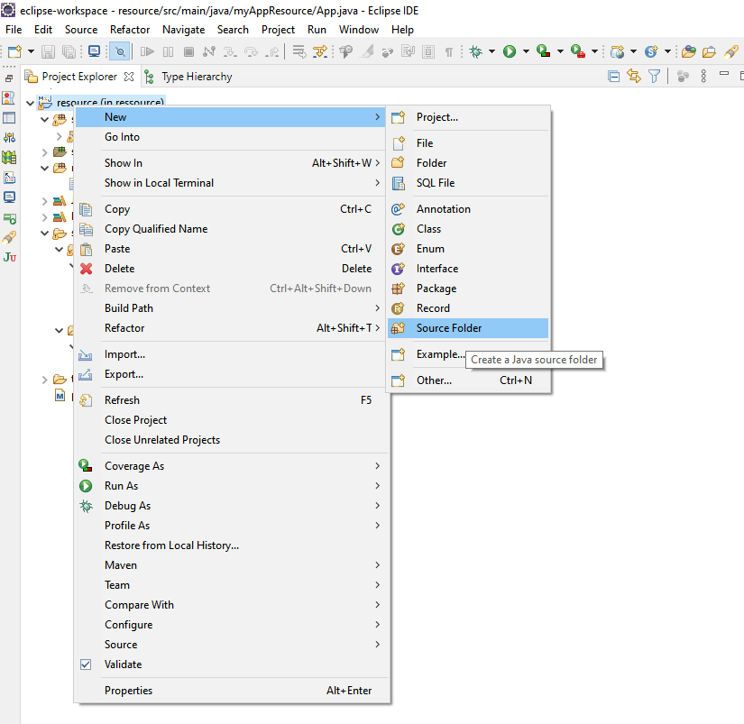
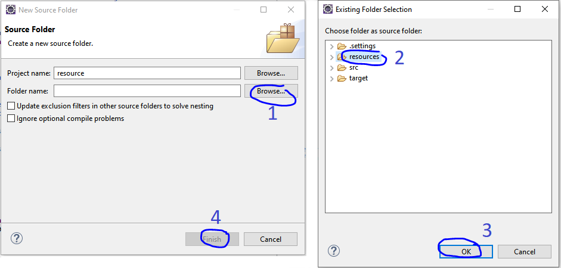

# 🚀 Java Properties File 🚀 <!-- omit in toc -->

<div align="center">


</div>

## Introduction <!-- omit in toc -->

```properties``` files with ```.properties``` extension is mainly used in Java for store the configurable parameters of an application.

Each parameter is stored as a pair of strings, one storing the name of the parameter (called the ```key/map```), and the other storing the value.

- [How to Read config.properties Values in Java?](#how-to-read-configproperties-values-in-java)
	- [Folder structure](#folder-structure)
	- [ResourceGetPropertyValues.java](#resourcegetpropertyvaluesjava)
	- [Result](#result)
- [How to Update config.properties File in Java?](#how-to-update-configproperties-file-in-java)
	- [Folder structure](#folder-structure-1)
	- [UpdateConfig_configuration1.java](#updateconfig_configuration1java)
	- [UpdateConfig_configuration2.java](#updateconfig_configuration2java)
	- [Result](#result-1)
- [Source](#source)

<br>

___

## How to Read config.properties Values in Java?
### Folder structure

For simplicity purpose we create a maven project using the command line from [getting started in 5 minutes [maven][article]](https://maven.apache.org/guides/getting-started/maven-in-five-minutes.html) :
```shell
mvn archetype:generate -DgroupId=myAppResource -DartifactId=resource -DarchetypeArtifactId=maven-archetype-quickstart -DarchetypeVersion=1.4 -DinteractiveMode=false
```


<details>
<summary>and obtain a project with this project structure :</summary>

```
.
├── src
│   ├── main
│   │   └── java
│   │       └── myAppResource
│   │           ├── App.java
│   └── test
│       └── java
│           └── ressource
│               └── AppTest.java
└── pom.xml
```
</details>

First we need to create a ```resources``` folder :



<details>
<summary style="color:red">in case you use the maven project inside the folder : How to Read config.properties in java</summary>



</details>

So this folder will be used for our project as a ```Source Folder``` and it's inside this folder that we will store all our ```.properties``` files.

Now we will simply create 2 files :
1. ```congig.properties``` inside ```Ressources```
2. ```ResourceGetPropertyValues.java``` inside ```java```

<details>
<summary>project structure : </summary>

```
.
├── resources
│   └── config.properties
├── src
│   ├── main
│   │   └── java
│   │       └── myAppResource
│   │           ├── App.java
│   │           └── ResourceGetPropertyValues.java
│   └── test
│       └── java
│           └── myAppResource
│               └── AppTest.java
└── pom.xml

```
</details>

### ResourceGetPropertyValues.java
```java
package myAppResource;
 
import java.io.FileNotFoundException;
import java.io.IOException;
import java.io.InputStream;
import java.util.Date;
import java.util.Properties;
 

public class ResourceGetPropertyValues {
	String result = "";
	InputStream inputStream;
 
	public String getPropValues(String propFilename, String Property) throws IOException {
 
		try {
			Properties prop = new Properties();
			
			
			inputStream = getClass().getClassLoader().getResourceAsStream(propFilename);
 
			if (inputStream != null) {
				prop.load(inputStream);
			} else {
				throw new FileNotFoundException("property file '" + propFilename + "' not found in the classpath");
			}
 
			Date time = new Date(System.currentTimeMillis());
 
			// get the property value and print it out
			result = prop.getProperty(Property);

 
			result = "Property = " + result + " for propFilename : " + propFilename;
			System.out.println(result + "\nProgram Ran on " + time);
		} catch (Exception e) {
			System.out.println("Exception: " + e);
		} finally {
			inputStream.close();
		}
		return result;
	}
}
```

### Result 


```
Hello World!
Property = resources for propFilename : config.properties
Program Ran on Thu Dec 16 09:23:39 CET 2021
Property = John Snow for propFilename : config.properties
Program Ran on Thu Dec 16 09:23:39 CET 2021
```

<br>
<br>

___

## How to Update config.properties File in Java? 

### Folder structure

For simplicity purpose just run this command line : 
```
mvn archetype:generate -DgroupId=myAppResource1 -DartifactId=resource_update -DarchetypeArtifactId=maven-archetype-quickstart -DarchetypeVersion=1.4 -DinteractiveMode=false
```

<br>

then add inside the pom.xml this dependancy :
```xml
<dependency>
    <groupId>org.apache.commons</groupId>
    <artifactId>commons-configuration2</artifactId>
    <version>2.7</version>
</dependency>
<dependency>
	<groupId>commons-configuration</groupId>
	<artifactId>commons-configuration</artifactId>
	<version>1.10</version>
</dependency>
<dependency>
    <groupId>commons-beanutils</groupId>
    <artifactId>commons-beanutils</artifactId>
    <version>1.9.3</version>
</dependency>
```
* ``commons-configuration2`` : is a new API for prop ressource file [source](https://commons.apache.org/proper/commons-configuration/userguide/upgradeto2_0.html) and [user guide [TOC]](https://commons.apache.org/proper/commons-configuration/userguide/user_guide.html)
* ``commons-configuration`` : is the old API for proptool file [user guide [TOC]](https://commons.apache.org/proper/commons-configuration/userguide_v1.10/user_guide.html)

<br>

On this example i create 2 examples where ``config.properties`` are updated at runtime, one for each API

For that we create 2 classe :
```
src
├── main
│   └── java
│       └── myAppResource1
│           ├── App.java
│           ├── config.properties
│           ├── UpdateConfig_configuration1.java => use commons-configuration
│           └── UpdateConfig_configuration2.java => use commons-configuration2
└── test
    └── java
        └── myAppResource1
            └── AppTest.java
```
Like for [How to Read config.properties Values in Java?](#how-to-read-configproperties-values-in-java) we create a ``resource folder`` with a ``config.properties`` file inside so our folder stucture become like this :
```
.
└── resource_update
    ├── resource
    │   └── config.properties
    ├── src
    │   ├── main
    │   │   └── java
    │   │       └── myAppResource1
    │   │           ├── App.java
    │   │           ├── config.properties
    │   │           ├── UpdateConfig_configuration1.java
    │   │           └── UpdateConfig_configuration2.java
    │   └── test
    │       └── java
    │           └── myAppResource1
    │               └── AppTest.java
    └── pom.xml
```

<br>

### UpdateConfig_configuration1.java

For the first file we use : commons-configuration [user guide [TOC]](https://commons.apache.org/proper/commons-configuration/userguide_v1.10/user_guide.html)
<details>
<summary>UpdateConfig_configuration1.java</summary>

```java
package myAppResource1;

import java.io.UnsupportedEncodingException;
import java.net.URL;
import java.net.URLDecoder;

import org.apache.commons.configuration.ConfigurationException;
import org.apache.commons.configuration.PropertiesConfiguration;


public class UpdateConfig_configuration1 {
	
	public PropertiesConfiguration config = new PropertiesConfiguration();

	
	public UpdateConfig_configuration1(String resourceFilePath) throws ConfigurationException 
	{
		this.config = new PropertiesConfiguration(resourceFilePath);
		this.config.setAutoSave(true);
		
	}


	public void Update(String KEY, String VALUE) throws ConfigurationException 
, UnsupportedEncodingException
	{
		
		if(this.config.containsKey(KEY))
		{
			this.config.setProperty(KEY, VALUE);
		}
		else
		{
			this.config.addProperty(KEY, VALUE);
		}
		

		
		System.out.println(URLDecoder.decode(this.config.getBasePath(), "UTF-8"));	
		this.config.save();
		System.out.println("Config Property Successfully Updated..");

	}

}
```
</details>

**Note :** ```URLDecoder.decode(this.config.getBasePath(), "UTF-8")``` allow me to decode a path URL and handling space for print the path of ```config.properties```

|Code|Description|
|---|---|
|public PropertiesConfiguration config = new PropertiesConfiguration();|Creates an empty PropertyConfiguration object which can be used to synthesize a new Properties file by adding values and then saving(). <br><br> here i initialize a ``PropertiesConfiguration`` object inside the attribut : ``config``|||
|this.config = new PropertiesConfiguration(resourceFilePath);|``resourceFilePath`` is a String representing the filename of the resourse file|
|this.config.setAutoSave(true);|``.setAutoSave(True)`` mean that the configuration file which is here : ``resourceFilePath`` will be change everytime a changement happen on configuration |
|this.config.containsKey(KEY)|return ```True``` if the KEY exist (Key is a String)|
|this.config.setProperty(KEY, VALUE);|maj a value wich already existing|
|this.config.addProperty(KEY, VALUE);|add a value|
|this.config.save();|force the save of the configuration file, if no value is passed as a parameter then that's will save inside ``this.config`` file path that we can find it with ```URLDecoder.decode(this.config.getBasePath(), "UTF-8")``` otherwise this method will save the changement inside the file you specified in parameter|

<br>

### UpdateConfig_configuration2.java

For the first file we use : commons-configuration2 [user guide [TOC]](https://commons.apache.org/proper/commons-configuration/userguide/user_guide.html)
<details>
<summary>UpdateConfig_configuration2.java</summary>

```java
package myAppResource1;

import java.io.FileNotFoundException;
import java.io.FileReader;
import java.io.StringWriter;

import org.apache.commons.configuration2.PropertiesConfiguration;
import org.apache.commons.configuration2.PropertiesConfigurationLayout;
import org.apache.commons.configuration2.ex.ConfigurationException;

public class UpdateConfig_configuration2 {
	
	public PropertiesConfiguration config = new PropertiesConfiguration();
	public PropertiesConfigurationLayout layout = new PropertiesConfigurationLayout();

	
	public UpdateConfig_configuration2(String resourceFilePath) throws FileNotFoundException, ConfigurationException  
	{
		this.config.setLayout(this.layout);
		this.layout.load(this.config, new FileReader(resourceFilePath));
		this.layout.setGlobalSeparator("=");
		
		
	}

	public void Update(String KEY, String VALUE) throws ConfigurationException {
		// TODO Auto-generated method stub
		if(this.config.containsKey(KEY))
		{
	    	System.out.println("case1");
			this.config.setProperty(KEY, VALUE);
		}
		else
		{
			this.config.addProperty(KEY, VALUE);
		}
		
		
		StringWriter stringWriter = new StringWriter();
		this.layout.save(this.config, stringWriter);

		

		System.out.println("Config Property Successfully Updated..");

	}

}
``` 
</details>

<br>

### Result

```
file:///C:/Users/xpierre/How to Update config.properties File in Java/resource_update/target/classes/config.properties
Config Property Successfully Updated..
config1 at runtime for the key valueKey as the value : John Snow is here
config1 at runtime for the key valueKey as the value : John Snow is here
case1
Config Property Successfully Updated..
config1 at runtime for the key valueKey as the value : Elon Musk
```
the new file will be inside :
```
.\target\classes
```

<br>

here : 
```
.
└── resource_update
    ├── .settings
    │   ├── org.eclipse.core.resources.prefs
    │   ├── org.eclipse.jdt.core.prefs
    │   └── org.eclipse.m2e.core.prefs
    ├── resource
    │   └── config.properties
    ├── src
    │   ├── main
    │   └── test
    ├── target
    │   ├── classes
    │   │   ├── META-INF
    │   │   ├── myAppResource1
    │   │   │   ├── App.class
    │   │   │   ├── config.properties
    │   │   │   ├── UpdateConfig_configuration1.class
    │   │   │   └── UpdateConfig_configuration2.class
    │   │   └── config.properties => localisation of config.properties for UpdateConfig_configuration1.java wich use commons-configuration
    │   └── resource_update-1.0-SNAPSHOT.jar
    ├── .classpath
    ├── .project
    └── pom.xml
```

<br>
<br>


___

## Source
* [commons-configuration2 : user guide [TOC]](https://commons.apache.org/proper/commons-configuration/userguide/user_guide.html)
* [commons-configuration : user guide [TOC]](https://commons.apache.org/proper/commons-configuration/userguide_v1.10/user_guide.html)
* [read config properties in java [crunchify.com]](https://crunchify.com/java-properties-file-how-to-read-config-properties-values-in-java/)
* [update config properties in java [crunchify.com]](https://crunchify.com/java-properties-files-how-to-update-config-properties-file-in-java/)
* [How to Build Java Project including all Dependencies Using Maven? maven-resources, maven-dependency and maven-jar Plugins [crunchify.com]](https://crunchify.com/how-to-create-build-java-project-including-all-dependencies-using-maven-maven-resources-maven-dependency-maven-jar-plugin-tutorial/)
* [How to Read config.properties value using Spring MVC ‘singleton’ Scope in Java? [crunchify.com]](https://crunchify.com/read-config-properties-value-using-spring-singleton-scope-in-your-java-enterprise-application/)
* [How to Use ResourceBundle.getBundle to get Properties Value at Runtime in Java? [crunchify.com]](https://crunchify.com/how-to-use-resourcebundle-getbundle-to-get-properties-value-at-runtime-in-java/)
* [How to Copy Properties from One Bean to Another [crunchify.com]](https://crunchify.com/java-how-to-copy-properties-from-one-bean-to-another/)

